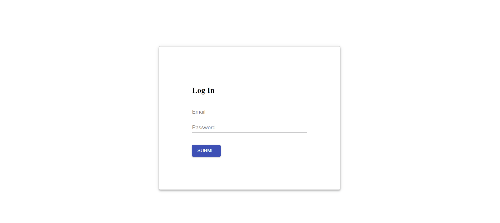

# React Express MSSQL App



## Login Credential

> pradeep.vwa@gmail.com/root

## Project covers

* React auth using jwt and passport.js.
* React and Sql-Server connection
* RestAPI call
* Export to Excel

### Rest APIs

| Methods | Urls             | Actions             |
|---------|------------------|---------------------|
| POST    | /api/post/login  | Login an account    |
| GET     | /api/get/user    | Access User Content |
| POST    | /api/post/user   | Access New User     |

### Technology

* React
* Material-UI
* Express.js
* bcryptjs
* jsonwebtoken
* Passport.js
* Session
* MSSQL

### Installation

```bash
# Package Installation
npm install

# Build the frontend and start project on express
npm start

# Start only React Application
npm devStart

# React Project Build
npm run build
```

### Database Setup

`config.js`

```js
let config = {
    "user": "sa",
    "password": "<your-db-password>",
    "server": "<your-db-ip-address>",
    "database": "<your-db-name>",
    "driver": "msnodesqlv8",
    "port": 1433
  };
```

### Resources

* *[React](https://reactjs.org/)*
* *[PM2](https://pm2.keymetrics.io/)*
* *[Material-UI](https://material-ui.com/)*
* *[Json Web Token](https://github.com/auth0/node-jsonwebtoken)*
