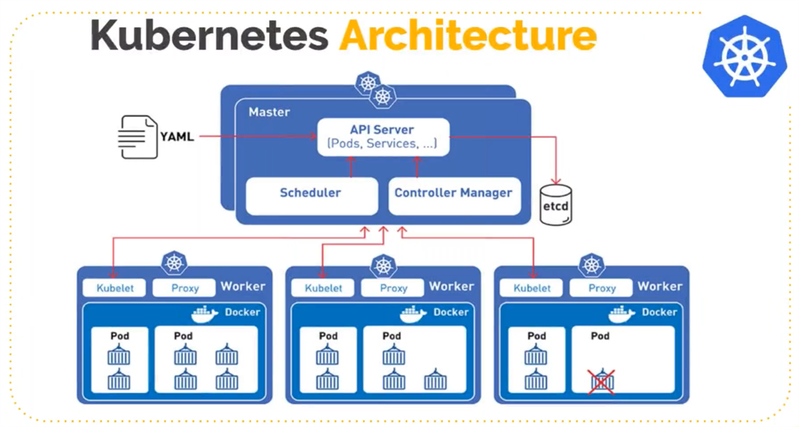
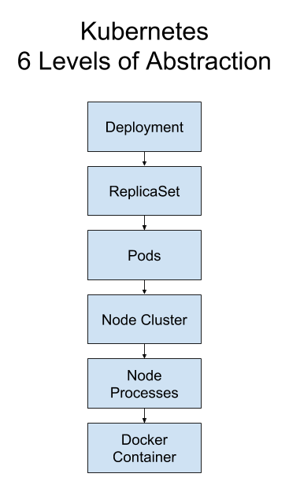
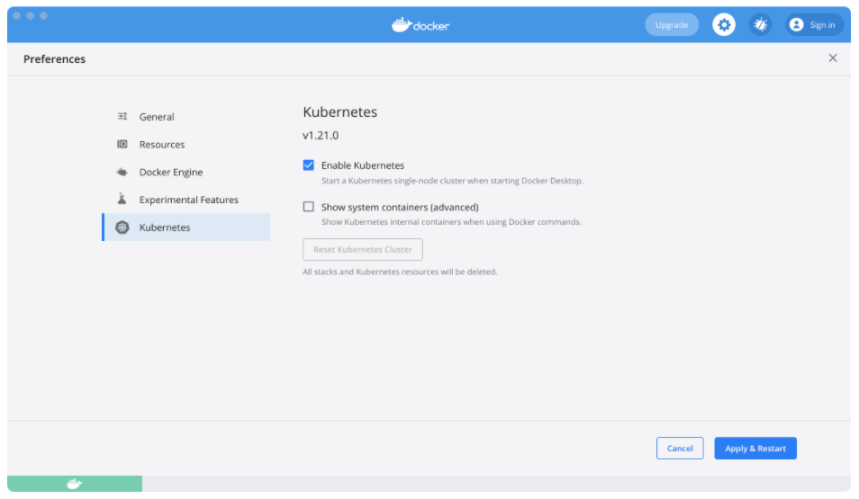

# Kubernetes Workshop

1. [Kubernetes Architecture](#1-Kubernetes-architecture)
1. [Kubernetes Installation and Dashboard Setup](#2-kubernetes-installation-and-dashboard-setup)
1. [Kubernetes Pod](#3-kubernetes-pod)
1. [Kubernetes Node](#4-kubernetes-node)
1. [Kubernetes Service](#5-kubernetes-service)
1. [Kubernetes Deployment](#6-kubernetes-deployment)
1. [Kubernetes ReplicaSet](#7-kubernetes-replicaset)
1. [Kubernetes Namespace](#8-kubernetes-namespace)
1. [Kubernetes Volume](#9-kubernetes-volume)
1. [Kubernetes Secrets](#10-kubernetes-secrets)
1. [Deploy a NodeJS application in Kubernetes Cluster](#11-deploy-a-nodejs-application-in-kubernetes-cluster)

<div align="right">
    <b><a href="#">↥ back to top</a></b>
</div>

## 1. Kubernetes Architecture

<p align="center">
  
</p>

<p align="center">
  
</p>

**1. Node:**

It represents a single machine in a cluster, which could be a physical machine in a data center or a virtual machine from a cloud provider. Each machine can substitute any other machine in a Kubernetes cluster.

<p align="center">
  
</p>

**2. Pod:**

A Pod is a group of one or more containers, with shared storage and network resources, and a specification for how to run the containers. Containers in the same pod share a local network and the same resources, allowing them to easily communicate with other containers in the same pod as if they were on the same machine while at the same time maintaining a degree of isolation.

**3. Service:**

A Kubernetes Service is an abstraction which defines a logical set of Pods running somewhere in your cluster, that all provide the same functionality. When created, each Service is assigned a unique IP address (also called clusterIP). This address is tied to the lifespan of the Service, and will not change while the Service is alive.

**4. ReplicaSet:**

A ReplicaSet\'s purpose is to maintain a stable set of replica Pods running at any given time. As such, it is often used to guarantee the availability of a specified number of identical Pods.

**5. Deployment:**

A Kubernetes deployment is a resource object in Kubernetes that provides declarative updates to applications. A deployment allows you to describe an application\'s life cycle, such as which images to use for the app, the number of pods there should be, and the way in which they should be updated.

**6. etcd:**

Kubernetes uses etcd as a distributed key-value store for all of its data, including metadata and configuration data, and allows nodes in Kubernetes clusters to read and write data.

**7. API Server:**

API server implements an interface, which means different tools and libraries can readily communicate with it. **Kubeconfig** is a package along with the server side tools that can be used for communication. It exposes Kubernetes API

**8. Kubelet:**

The kubelet is a service agent that controls and maintains a set of pods by watching for pod specs through the Kubernetes API server. It preserves the pod lifecycle by ensuring that a given set of containers are all running as they should. The kubelet runs on each node and enables the communication between the master and slave nodes.

**9. Controller Manager:**

In Kubernetes, different methods are operating on the master node, and they are accumulated together as the Kubernetes Controller Manager. It is a daemon which installs regulators, including the given below:

* Replication Controller
* Node Controller
* Endpoint controller
* Administration record and token regulator

**10. Scheduler:**

The scheduler ( Kube-scheduler ) is responsible for workload utilization and allocating pod to new node. It makes sure that no workload is scheduled on already full nodes.

**11. Kubernetes Proxy Service:**

This is a proxy ( Kube-proxy ) service which runs on each node and helps in making services available to the external host. It helps in forwarding the request to correct containers and is capable of performing primitive load balancing.

<div align="right">
    <b><a href="#">↥ back to top</a></b>
</div>

## 2. Kubernetes Installation and Dashboard Setup

**Kubernetes Installation:**

To enable Kubernetes support and install a standalone instance of Kubernetes running as a Docker container, go to **Preferences > Kubernetes** and then click **Enable Kubernetes**.

Click **Apply & Restart** to save the settings and then click **Install** to confirm. This instantiates images required to run the Kubernetes server as containers, and installs the `/usr/local/bin/kubectl` command on your machine.

<p align="center">
  
</p>

* [Visual Studio Code Kubernetes plugin](https://marketplace.visualstudio.com/items?itemName=ms-kubernetes-tools.vscode-kubernetes-tools)

**Dashboard Setup:**

* [Kubernetes UI Dashboard Docker Image](https://hub.docker.com/r/kubernetesui/dashboard)
* [Dashboard Settings](https://github.com/kubernetes/dashboard)
* [Creating Sample User](https://github.com/kubernetes/dashboard/blob/master/docs/user/access-control/creating-sample-user.md)

```js
kubectl proxy                               // Launch Kubernetes Dashboard
```

* [Kubernetes UI Dashboard Login](http://localhost:8001/api/v1/namespaces/kubernetes-dashboard/services/https:kubernetes-dashboard:/proxy/#/login)

<div align="right">
    <b><a href="#">↥ back to top</a></b>
</div>

## 3. Kubernetes Pod

The following is an example of a Pod which consists of a container running the image nginx:1.14.2.

```yaml
apiVersion: v1
kind: Pod
metadata:
  name: nginx-pod
  labels:
    name: nginx
spec:
  containers:
  - name: nginx
    image: nginx:1.14.2
    resources:
      limits:
        memory: "128Mi"
        cpu: "500m"
    ports:
      - containerPort: 80
```

```bash
kubectl apply -f nginx-pod.yaml
kubectl get pod nginx-pod
kubectl describe pod nginx-pod
```

<div align="right">
    <b><a href="#">↥ back to top</a></b>
</div>

## 4. Kubernetes Node

```bash
kubectl get node

# Output
NAME             STATUS   ROLES                  AGE   VERSION
docker-desktop   Ready    control-plane,master   41d   v1.21.5
```

<div align="right">
    <b><a href="#">↥ back to top</a></b>
</div>

## 5. Kubernetes Service

```yaml
apiVersion: v1
kind: Service
metadata:
  name: nginx-service
spec:
  selector:
    app: nginx
  ports:
  - port: 80
    targetPort: 8080
```

```bash
kubectl apply -f nginx-service.yaml     # Apply nginx service
kubectl get pod
kubectl get services
kubectl describe service nginx-service  # Get service description
kubectl get pod -o wide                 # Get detail information of POD
kubectl get deployment nginx-deployment -o yaml > nginx-deployment-result.yaml  # Export deployment yaml result
```

<div align="right">
    <b><a href="#">↥ back to top</a></b>
</div>

## 6. Kubernetes Deployment

```yaml
apiVersion: apps/v1
kind: Deployment
metadata:
  name: nginx-deployment
spec:
  replicas: 2
  selector:
    matchLabels:
      app: nginx
  template:
    metadata:
      labels:
        app: nginx
    spec:
      containers:
      - name: nginx
        image: 1.14.2
        resources:
          limits:
            memory: "128Mi"
            cpu: "500m"
        ports:
        - containerPort: 8080
```

```bash
kubectl apply -f nginx-deployment.yaml
kubectl get pod                           # Get replicaSets running details
kubectl get deployment
kubectl describe deployment nginx-deployment
```

<div align="right">
    <b><a href="#">↥ back to top</a></b>
</div>

## 7. Kubernetes ReplicaSet

A ReplicaSet\'s purpose is to maintain a stable set of replica Pods running at any given time. As such, it is often used to guarantee the availability of a specified number of identical Pods.

```yaml
apiVersion: apps/v1
kind: ReplicaSet
metadata:
  name: nginx-replica
  labels:
    app: nginx
    tier: backend
spec:
  replicas: 2
  selector:
    matchLabels:
      tier: backend
  template:
    metadata:
      labels:
        tier: backend
    spec:
      containers:
      - name: nginx
        image: nginx:1.14.2
```

```bash
kubectl apply -f nginx-replicaset.yaml
kubectl get rs
kubectl describe rs nginx-replica
```

<div align="right">
    <b><a href="#">↥ back to top</a></b>
</div>

## 8. Kubernetes Namespace

Namespaces are used for dividing cluster resources between multiple users. They are meant for environments where there are many users spread across projects or teams and provide a scope of resources.

```bash
kubectl get namespaces

# Output
NAME          STATUS    AGE
default       Active    11d
kube-system   Active    11d
kube-public   Active    11d
```

* `default` The default namespace for objects with no other namespace
* `kube-system` The namespace for objects created by the Kubernetes system
* `kube-public` This namespace is created automatically and is readable by all users

```yaml
apiVersion: v1
kind: Namespace
metadata:
  name: nginx-namespace
```

```bash
kubectl apply -f nginx-namespace.yaml
kubectl get namespace
kubectl describe namespace nginx-namespace
```

<div align="right">
    <b><a href="#">↥ back to top</a></b>
</div>

## 9. Kubernetes Volume

A Kubernetes volume is a directory that contains data accessible to containers in a given Pod in the orchestration and scheduling platform. Volumes provide a plug-in mechanism to connect ephemeral containers with persistent data stores elsewhere.

Kubernetes volumes persist until the Pod -- Kubernetes\'s atomic unit of container deployment -- is deleted. When a Pod with a unique identification is deleted, the volume associated with it gets destroyed. If a Pod is deleted but replaced with an identical Pod, a new and identical volume is also created. Kubernetes supports more than 20 types of volumes.

**Persistent Volume (PV):** − It\'s a piece of network storage that has been provisioned by the administrator. It\'s a resource in the cluster which is independent of any individual pod that uses the PV.

**Persistent Volume Claim (PVC):** − The storage requested by Kubernetes for its pods is known as PVC. The user does not need to know the underlying provisioning. The claims must be created in the same namespace where the pod is created.

```yaml
apiVersion: v1
kind: PersistentVolume
metadata:
  name: nginx-volume
spec:
  capacity:
    storage: 500Gi
  volumeMode: Filesystem
  accessModes:
    - ReadWriteOnce
  persistentVolumeReclaimPolicy: Recycle
  storageClassName: slow
  mountOptions:
    - hard
    - nfsvers=4.1
  nfs:
    path: /tmp
    server: 172.17.0.2
```

```bash
kubectl apply -f nginx-volume.yaml
kubectl get pv
kubectl describe pv nginx-volume
```

<div align="right">
    <b><a href="#">↥ back to top</a></b>
</div>

## 10. Kubernetes Secrets

```yaml
apiVersion: v1
kind: Secret
metadata:
  name: nginx-secret
type: Opaque
data:
  nginx-root-username: dXNlcm5hbWU=
  nginx-root-password: cGFzc3dvcmQ=
```

```bash
kubectl apply -f nginx-secret.yaml
kubectl get secret nginx-secret
kubectl describe secret nginx-secret
```

```yaml
apiVersion: v1
kind: Pod
metadata:
  name: nginx-pod
  labels:
    name: nginx
spec:
  containers:
  - name: nginx
    image: nginx:1.14.2
    resources:
      limits:
        memory: "128Mi"
        cpu: "500m"
    ports:
      - containerPort: 80
    env:
      - name: NGINX_ROOT_USERNAME
        valueFrom:
          secretKeyRef:
             name: nginx-secret
             key: nginx-root-username
      - name: NGINX_ROOT_PASSWORD
        valueFrom:
          secretKeyRef:
             name: nginx-secret
             key: nginx-root-password
```

```bash
kubectl apply -f nginx-pod.yaml
kubectl get secret nginx-pod
kubectl describe secret nginx-pod
```

<div align="right">
    <b><a href="#">↥ back to top</a></b>
</div>

## 11. Deploy a NodeJS application in Kubernetes Cluster

```yaml
apiVersion: apps/v1
kind: Deployment
metadata:
  name: nodejs-deployment
spec:
  replicas: 2
  selector:
    matchLabels:
      app: nodejs
  template:
    metadata:
      labels:
        app: nodejs
    spec:
      containers:
      - name: nodejsapp
        image: sofyspace/nodejs-starter:1.0
        resources:
          limits:
            memory: "128Mi"
            cpu: "500m"
        ports:
        - containerPort: 3000
---
apiVersion: v1
kind: Service
metadata:
  name: nodejs-service
spec:
  selector:
    app: nodejsapp
  ports:
  - port: 80
    targetPort: 3000
```

```js
kubectl apply -f nodejs-deployment.yaml
kubectl get all
kubectl expose deployment nodejs-deployment --type="LoadBalancer"
kubectl get svc

// Output
cmd> kubectl get svc
NAME                                      TYPE           CLUSTER-IP       EXTERNAL-IP   PORT(S)                      AGE
kubernetes                                ClusterIP      10.96.0.1        <none>        443/TCP                      56d
nodejs-deployment                         LoadBalancer   10.110.82.211    localhost     3000:32327/TCP               11s
nodejs-service                            ClusterIP      10.110.60.110    <none>        80/TCP                       2m25s
```

<div align="right">
    <b><a href="#">↥ back to top</a></b>
</div>

## Kubectl Basic Commands

```js
kubectl get nodes | pod | services | replicaset | deployment

kubectl version                             // Kubectl version
kubectl version --client                    // Kubectl client version
kubectl get pod                             // Get list of PODs
kubectl get services                        // Display list of services
kubectl create deployment nginx-depl --image=nginx  // create deployment using nginx
kubectl get deployment                              // Get deployment list
kubectl get replicaset
kubectl edit deployment nginx-depl          // get auto-generated configuration file with default values
kubectl get pod                             // Old pod will terminate and new pod will be generated based on new values
kubectl get replicaset                      // Old replicaset will have zero pod
kubectl logs <deployment_name>              // Get pod logs
kubectl create deployment mongo-depl --image=mongo
kubectl describe pod <pod_name>             // Get info about pod
kubectl logs <pod_name>
kubectl exec -it <pod_name> -- bin/bash     // Get interactive terminal
# ls
kubectl get deployment                      // Get list of deployment
kubectl get pod                             // Get list of PODs
kubectl delete deployment <deployment_name> // Delete deployment
kubectl get deployment
kubectl get pod
kubectl get replicaset
kubectl apply -f <file_name>                // Deployment using .yaml config file
kubectl cluster-info                        // Get Cluster Info
kubectl cluster-info dump                   // Debug and diagnose cluster 
```

**nginx-deployment.yaml:**

```js
apiVersion: apps/v1
kind: Deployment
metadata:
  name: nginx-deployment
  labels:
    app: nginx
spec:
  replicas: 2
  selector:
    matchLabels:
      app: nginx
  template:
    metadata:
      labels:
        app: nginx
    spec:
      containers:
      - name: nginx
        image: nginx:1.16
        ports:
        - containerPort: 8080
```

```js
kubectl apply -f nginx-deployment.yaml
kubectl get pod
kubectl get deployment
kubectl delete -f <file_name>
```

**nginx-service.yaml:**

```js
apiVersion: v1
kind: Service
metadata:
  name: nginx-service
spec:
  selector:
    app: nginx
  ports:
    - protocol: TCP
      port: 80
      targetPort: 8080
```

```js
kubectl apply -f nginx-service.yaml                                             // Apply nginx service
kubectl get pod
kubectl get service                             
kubectl describe service nginx-service                                          // Get service description
kubectl get pod -o wide                                                         // Get detail information of POD
kubectl get deployment nginx-deployment -o yaml > nginx-deployment-result.yaml  // Deployment yaml result
kubectl delete -f nginx-deployment.yaml
kubectl delete - f nginx-service.yaml
```

<div align="right">
    <b><a href="#">↥ back to top</a></b>
</div>

## Application Deployment

```js
kubectl get all     // Get all the cluster details
```

**mongo.yaml:**

```js
apiVersion: apps/v1
kind: Deployment
metadata:
  name: mongodb-deployment
  labels:
    app: mongodb
spec:
  replicas: 1
  selector:
    matchLabels:
      app: mongodb
  template:
    metadata:
      labels:
        app: mongodb
    spec:
      containers:
      - name: mongodb
        image: mongo
        ports:
        - containerPort: 27017
        env:
        - name: MONGO_INITDB_ROOT_USERNAME
          valueFrom:
            secretKeyRef:
              name: mongodb-secret
              key: mongo-root-username
        - name: MONGO_INITDB_ROOT_PASSWORD
          valueFrom: 
            secretKeyRef:
              name: mongodb-secret
              key: mongo-root-password
---
apiVersion: v1
kind: Service
metadata:
  name: mongodb-service
spec:
  selector:
    app: mongodb
  ports:
    - protocol: TCP
      port: 27017
      targetPort: 27017
```

**mongo-secret.yaml:**

```js
apiVersion: v1
kind: Secret
metadata:
    name: mongodb-secret
type: Opaque
data:
    mongo-root-username: dXNlcm5hbWU=
    mongo-root-password: cGFzc3dvcmQ=
```

```js
kubectl apply -f mongo-secret.yaml        // Apply MongoDB secret
kubectl get secret                        // Get secret
kubectl apply -f mongo.yaml               // Apply MongoDB config file
kubectl get all
kubectl get pod --watch                   // Watch incase of POD is getting created
kubectl describe pod <pod_name>           // check if any error
kubectl get service
kubectl describe service mongodb-service 
kubectl get pod -o wide                   // verify IP address used by POD in service
kubectl get all | findstr mongodb
```

**mongo-express.yaml:**

```js
apiVersion: apps/v1
kind: Deployment
metadata:
  name: mongo-express
  labels:
    app: mongo-express
spec:
  replicas: 1
  selector:
    matchLabels:
      app: mongo-express
  template:
    metadata:
      labels:
        app: mongo-express
    spec:
      containers:
      - name: mongo-express
        image: mongo-express
        ports:
        - containerPort: 8081
        env:
        - name: ME_CONFIG_MONGODB_ADMINUSERNAME
          valueFrom:
            secretKeyRef:
              name: mongodb-secret
              key: mongo-root-username
        - name: ME_CONFIG_MONGODB_ADMINPASSWORD
          valueFrom: 
            secretKeyRef:
              name: mongodb-secret
              key: mongo-root-password
        - name: ME_CONFIG_MONGODB_SERVER
          valueFrom: 
            configMapKeyRef:
              name: mongodb-configmap
              key: database_url
---
apiVersion: v1
kind: Service
metadata:
  name: mongo-express-service
spec:
  selector:
    app: mongo-express
  type: LoadBalancer  
  ports:
    - protocol: TCP
      port: 8081
      targetPort: 8081
      nodePort: 30000
```

**mongo-configmap.yaml:**

```js
apiVersion: v1
kind: ConfigMap
metadata:
  name: mongodb-configmap
data:
  database_url: mongodb-service
```

```js
kubectl apply -f mongo-configmap.yaml       // Apply mongo configmap
kubectl apply -f mongo-express.yaml         // Apply mongo-express 
kubectl get pod                             
kubectl logs mongo-express-78fcf796b8-xhp2f // Get Mongo-Express logs
minikube service mongo-express-service      // Access MongoDB from external URL
kubectl get namespace                       // Get Kubernetes Namespace
kubectl create namespace my-namespace       // Create a new namespace
kubectl delete namespace my-namespace       // Delete namespace
kubectl cluster-info                        // Display cluster info
kubectl get ns                              // Display list of namespaces
kubectl get all -n kubernetes-dashboard     // Get POD, Service, Deployment and Replicaset details of namespace
```

**dashboard-ingress.yaml**

```js
apiVersion: networking.k8s.io/v1
kind: Ingress
metadata:
  name: dashboard-ingress
  namespace: kubernetes-dashboard
spec:
  rules:
  - host: dashboard.com
    http:
      paths:
      - pathType: Prefix
        path: "/"
        backend:
          service:
            name: kubernetes-dashboard
            port: 
              number: 80
```

```js
kubectl apply -f dashboard-ingress.yaml                 // Create Ingress controller on Kubernetes Dashboard
kubectl get ingress -n kubernetes-dashboard             // Display Ingress controller details
kubectl get ingress -n kubernetes-dashboard --watch     // To watch IP Address 
kubectl describe ingress dashboard-ingress -n kubernetes-dashboard // 
```

**postgres.yaml**

```js
apiVersion: v1
kind: Pod
metadata:
  name: postgres
  labels:
    name: postgres
spec:
  containers:
  - name: postgres
    image: postgres:latest
    resources:
      limits:
        memory: "128Mi"
        cpu: "500m"
    ports:
    - containerPort: 5432
    env:
    - name: POSTGRES_PASSWORD
      value: "pwd"
```

```js
kubectl apply -f postgres.yaml
kubectl get pod
```

**postgres.yaml**

```js
apiVersion: v1
kind: Pod
metadata:
  name: postgres-2
  labels:
    name: postgres-2
spec:
  containers:
  - name: postgres
    image: postgres:latest
    resources:
      limits:
        memory: "128Mi"
        cpu: "500m"
    ports:
    - containerPort: 5432
    env:
    - name: POSTGRES_PASSWORD
      value: "pwd"
```

```js
kubectl apply -f postgres.yaml
kubectl get pod
```

**nginx-sidecar-container.yaml**

```js
apiVersion: v1
kind: Pod
metadata:
  name: nginx
  labels:
    name: nginx
spec:
  containers:
  - name: nginx-container
    image: nginx
    resources:
      limits:
        memory: "128Mi"
        cpu: "500m"
    ports:
    - containerPort: 80
  - name: sidecar
    image: curlimages/curl
    resources:
      limits:
        memory: "128Mi"
        cpu: "500m"
    command: ["/bin/sh"]
    args: ["-c", "echo Hello from the sidecar container; sleep 300"]
```

```js
kubectl apply -f nginx-sidecar-container.yaml
kubectl get pod
kubectl exec -it nginx -c sidecar -- /bin/sh
$ netstat -ln                                     // Display list of IP Address
$ curl localhost:80
$ exit
kubectl logs nginx -c nginx-container             // View nginx logs
minikube start                                    // Install minikube
minikube ssh                                      // SSH to minikibe
kubectl get configmap                             // Display Config Map details
```

<div align="right">
    <b><a href="#">↥ back to top</a></b>
</div>

## [Install Prometheus Operator](https://grafana.com/docs/grafana-cloud/quickstart/prometheus_operator/)

```js
kubectl apply -f https://raw.githubusercontent.com/prometheus-operator/prometheus-operator/master/bundle.yaml
kubectl get deploy                                // Verify Prometheus Operator
mkdir operator_k8s
cd operator_k8s

kubectl get secret                                // Get Secrets
kubectl get statefulset
```

<div align="right">
    <b><a href="#">↥ back to top</a></b>
</div>

## Install Promethus Operator using Helm

**add repo:**

```js
helm repo add prometheus-community https://prometheus-community.github.io/helm-charts
helm repo add stable https://charts.helm.sh/stable
helm repo update
```

**install chart:**

```js
helm install prometheus prometheus-community/kube-prometheus-stack
```

```js
kubectl get pod
kubectl get svc
kubectl port-forward service/prometheus-kube-prometheus-prometheus 9090
kubectl get servicemonitor
kubectl get servicemonitor prometheus-kube-prometheus-grafana -oyaml       // View yaml file
kubectl get crd                                       // Display Custom Resource Definitions
```

<div align="right">
    <b><a href="#">↥ back to top</a></b>
</div>
