# Kubernetes Interview Questions

## Table of Contents

|Sl.No|  Questions                         |
|-----|------------------------------------|
| 01.|[What is Kubernetes?](#q-what-is-kubernetes)|
| 02.|[How Container orchestration is beneficial?](#q-how-container-orchestration-is-beneficial)|
| 03.|[How are Kubernetes and Docker related?](#q-how-are-kubernetes-and-docker-related)|
| 04.|[What is a node in Kubernetes?](#q-what-is-a-node-in-kubernetes)|
| 05.|[What are pods in Kubernetes?](#q-what-are-pods-in-kubernetes)|
| 06.|[What is a Kubernetes deployment?](#q-what-is-a-kubernetes-deployment)|
| 07.|[Explain the use case of Kubernetes deployment?](#q-explain-the-use-case-of-kubernetes-deployment)|
| 08.|[What is the difference between a pod and a deployment?](#q-what-is-the-difference-between-a-pod-and-a-deployment)|
| 09.|[What are Kubernetes Services?](#q-what-are-kubernetes-services)|
| 10.|[What is replicaset in kubernetes?](#q-what-is-replicaset-in-kubernetes)|
| 11.|[What are clusters in Kubernetes?](#q-what-are-clusters-in-kubernetes)|
| 12.|[What are Daemon sets?](#q-what-are-daemon-sets)|
| 13.|[What is Heapster in Kubernetes?](#q-what-is-heapster-in-kubernetes)|
| 14.|[What is a Namespace in Kubernetes?](#q-what-is-a-namespace-in-kubernetes)|
| 15.|[Why use namespaces?](#q-why-use-namespaces)|
| 16.|[What is the Kubernetes controller manager?](#q-what-is-the-kubernetes-controller-manager)|
| 17.|[What are the types of controller managers?](#q-what-are-the-types-of-controller-managers)|
| 18.|[What is ETCD in Kubernetes?](#q-what-is-etcd-in-kubernetes)|
| 19.|[What is ClusterIP?](#q-what-is-clusterip)|
| 20.|[What is NodePort?](#q-what-is-nodeport)|
| 21.|[What is a headless service?](#q-what-is-a-headless-service)|
| 22.|[What is Kubelet?](#q-what-is-kubelet)|
| 23.|[What is the Load Balancer in Kubernetes?](#q-what-is-the-load-balancer-in-kubernetes)|
| 24.|[What is Kubectl?](#q-what-is-kubectl)|
| 25.|[What is Kube-proxy?](#q-what-is-kube-proxy)|
| 26.|[Can we put multiple containers inside a pod?](#q-can-we-put-multiple-containers-inside-a-pod)|
| 27.|[Name some container patterns you come across or use?](#q-name-some-container-patterns-you-come-across-or-use)|
| 28.|[What is Init Container Pattern?](#q-what-is-init-container-pattern)|
| 29.|[When do you use Init Container Pattern?](#q-when-do-you-use-init-container-pattern)|
| 30.|[How do you configure resource limits for the Init Container Pattern?](#q-how-do-you-configure-resource-limits-for-the-init-container-pattern)|
| 31.|[What is Sidecar Container Design?](#q-what-is-sidecar-container-design)|
| 32.|[When do you use Sidecar Container Pattern?](#q-when-do-you-use-sidecar-container-pattern)|
| 33.|[How do you configure resource limits for the Sidecar Container Pattern?](#q-how-do-you-configure-resource-limits-for-the-sidecar-container-pattern)|
| 34.|[What is Adapter Container Pattern?](#q-what-is-adapter-container-pattern)|
| 35.|[When do you use Adapter Container Pattern?](#q-when-do-you-use-adapter-container-pattern)|
| 36.|[How do you configure resource limits for the Adapter Container Pattern?](#q-how-do-you-configure-resource-limits-for-the-adapter-container-pattern)|
| 37.|[What is Ambassador Container Pattern?](#q-what-is-ambassador-container-pattern)|
| 38.|[When do you use Ambassador Container Pattern?](#q-when-do-you-use-ambassador-container-pattern)|
| 39.|[How do you configure resource limits for the Ambassador Container Pattern?](#q-how-do-you-configure-resource-limits-for-the-ambassador-container-pattern)|
| 40.|[Point out the tools which are utilized for container monitoring?](#q-point-out-the-tools-which-are-utilized-for-container-monitoring)|
| 41.|[Disadvantages of Kubernetes](#q-disadvantages-of-kubernetes)|
| 42.|[Why use Kubernetes?](#q-why-use-kubernetes)|
| 43.|[What is the function of clusters in Kubernetes?](#q-what-is-the-function-of-clusters-in-kubernetes)|
| 44.|[Characteristics of Kubernetes](#q-characteristics-of-kubernetes)|
| 45.|[Define Ingress network](#q-define-ingress-network)|
| 46.|[List the uses of GKE](#q-list-the-uses-of-gke)|
| 47.|[Explain the main components of Kubernetes architecture?](#q-explain-the-main-components-of-kubernetes-architecture)|
| 48.|[How do we control the resource usage of POD?](#q-how-do-we-control-the-resource-usage-of-pod)|
| 49.|[What are the various K8s services running on nodes and describe the role of each service?](#q-what-are-the-various-k8s-services-running-on-nodes-and-describe-the-role-of-each-service)|
| 50.|[What is PDB (Pod Disruption Budget)?](#q-what-is-pdb-pod-disruption-budget)|
| 51.|[What are the various things that can be done to increase Kubernetes security?](#q-what-are-the-various-things-that-can-be-done-to-increase-kubernetes-security)|
| 52.|[How to monitor the Kubernetes cluster?](#q-how-to-monitor-the-kubernetes-cluster)|
| 53.|[How to get the central logs from POD?](#q-how-to-get-the-central-logs-from-pod)|
| 54.|[How to turn the service defined below in the spec into an external one?](#q-how-to-turn-the-service-defined-below-in-the-spec-into-an-external-one)|
| 55.|[How to configure TLS with Ingress?](#q-how-to-configure-tls-with-ingress)|
| 56.|[What is a Kubernetes Operator?](#q-what-is-a-kubernetes-operator)|
| 57.|[Why do we need Operators?](#q-why-do-we-need-operators)|
| 58.|[What difference do you find between Docker Swarm and Kubernetes?](#q-what-difference-do-you-find-between-docker-swarm-and-kubernetes)|
| 59. |[What difference do you find between deploying applications on the host and containers?](#q-what-difference-do-you-find-between-deploying-applications-on-the-host-and-containers)|
| 60.|[What is Minikube?](#q-what-is-minikube)|
| 61.|[How Kubernetes simplifies the containerized Deployment](#q-how-kubernetes-simplifies-the-containerized-deployment)|
| 62.|[What is the role of Kube-apiserver and Kube-scheduler?](#q-what-is-the-role-of-kube-apiserver-and-kube-scheduler)|
| 63.|[How do master nodes in Kubernetes work?](#q-how-do-master-nodes-in-kubernetes-work)|
| 64.|[What are the different types of services in Kubernetes?](#q-what-are-the-different-types-of-services-in-kubernetes)|
| 65.|[What do you understand about Cloud controller managers?](#q-what-do-you-understand-about-cloud-controller-managers)|
| 66.|[What is the difference between a replica set and a replication controller?](#q-what-is-the-difference-between-a-replica-set-and-a-replication-controller)|
| 67.|[What are federated clusters?](#q-what-are-federated-clusters)|
| 68.|[What are the best security measures that you can take while using Kubernetes?](#q-what-are-the-best-security-measures-that-you-can-take-while-using-kubernetes)|
| 69.|[What are the main differences between the Docker Swarm and Kubernetes?](#q-what-are-the-main-differences-between-the-docker-swarm-and-kubernetes)|
| 70.|[What are the types of secrets available in Kubernetes?](#q-what-are-the-types-of-secrets-available-in-kubernetes)|
| 71.|[How to use secrets in Kubernetes?](#q-how-to-use-secrets-in-kubernetes)|
| 72.|[How to Create and Use ConfigMap with Kubernetes?](#q-how-to-create-and-use-configmap-with-kubernetes)|
| 73.|[What is a Kubernetes StatefulSet?](#q-what-is-a-kubernetes-statefulset)|
| 74.|[What are levels of abstraction in Kubernetes?](#q-what-are-levels-of-abstraction-in-kubernetes)|
| 75.|[How to Configure Kubernetes for Rolling Update?](#q-how-to-configure-kubernetes-for-rolling-update)|
| 76.|[What is the difference between Docker Compose and Kubernetes?](#q-what-is-the-difference-between-docker-compose-and-kubernetes)|
| 77.|[How to use local docker images with Minikube?](#q-how-to-use-local-docker-images-with-minikube)|
| 78.|[What is the difference between ClusterIP, NodePort and LoadBalancer service types in Kubernetes?](#q-what-is-the-difference-between-clusterip-nodeport-and-loadbalancer-service-types-in-kubernetes)|
| 79.|[What is the difference between kubernetes load balancer and ingress controller?](#q-what-is-the-difference-between-kubernetes-load-balancer-and-ingress-controller)|
| 80.|[How to delete all pods in kubernetes namespaces?](#q-how-to-delete-all-pods-in-kubernetes-namespaces)|
| 81.|[How do I force Kubernetes to re-pull an image?](#q-how-do-i-force-kubernetes-to-re-pull-an-image)|
| 82.|[How can I keep a container running on Kubernetes?](#q-how-can-i-keep-a-container-running-on-kubernetes)|
| 83.|[What is required to deploy a simple application, like a web server in Kubernetes?](#q-what-is-required-to-deploy-a-simple-application-like-a-web-server-in-kubernetes)|
| 84.|[When would you use a Deployment versus a StatefulSet versus a DaemonSet?](#q-when-would-you-use-a-deployment-versus-a-statefulset-versus-a-daemonset)|
| 85.|[What are container orchestrators and why are they required?](#q-what-are-container-orchestrators-and-why-are-they-required)|
| 86.|[What type of workloads run well on Kubernetes, and what types do not?](#q-what-type-of-workloads-run-well-on-kubernetes-and-what-types-do-not)|
| 87.|[What is the Operator pattern and when should you use it?](#q-what-is-the-operator-pattern-and-when-should-you-use-it)|
| 88.|[How can RBAC be used to grant permission to Kubernetes resources?](#q-how-can-rbac-be-used-to-grant-permission-to-kubernetes-resources)|
| 89.|[How would you expose an application running in a Kubernetes cluster to the outside world?](#q-how-would-you-expose-an-application-running-in-a-kubernetes-cluster-to-the-outside-world)|
| 90.|[What is Helm Charts?](#q-what-is-helm-charts)|
| 91.|[How to persist data in kubernetes using volumes?](#q-how-to-persist-data-in-kubernetes-using-volumes)|
| 92.|[How to create storage class in kubernetes?](#q-how-to-create-storage-class-in-kubernetes)|
| 93.|[How to deploy to kubernetes cluster on google cloud?](#q-how-to-deploy-to-kubernetes-cluster-on-google-cloud)|
| 94.|[Kubernetes APIs have been described as both imperative and declarative. What does this mean?](#q-kubernetes-apis-have-been-described-as-both-imperative-and-declarative-what-does-this-mean)|

<div align="right">
    <b><a href="#">↥ back to top</a></b>
</div>

## Q. ***What is Kubernetes?***

Kubernetes is an open-source container orchestration tool or system that is used to automate tasks such as the management, monitoring, scaling, and deployment of containerized applications. It is used to easily manage several containers (since it can handle grouping of containers), which provides for logical units that can be discovered and managed.

<div align="right">
    <b><a href="#">↥ back to top</a></b>
</div>

## Q. ***How Container orchestration is beneficial?***

Container orchestration is a process of managing the life cycles of containers more specifically in large & dynamic environments. All the services in the individual container are in synchronization to fulfill the needs of the server. Container orchestration is used to regulate and automate tasks such as:

* Provisioning and deployment of containers
* Upscaling or removing containers to divide application load evenly all across host infrastructure
* Redundancy and availability of containers
* Moving of containers from one host to another in case there is a shortage of resources in a host (or when the host dies)
* Allocation resources across containers
* Health monitoring of containers and hosts
* Externally exposing services running in a container to the outside world
* Load balancing of service discovery across containers
* Configuring an application relative to the containers running it

<p align="center">
  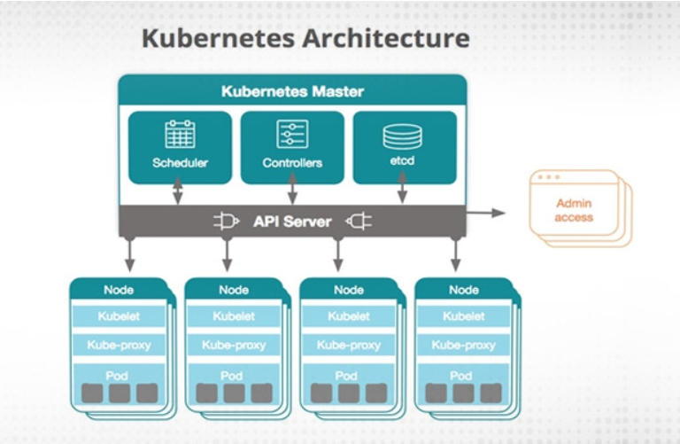
</p>

<div align="right">
    <b><a href="#">↥ back to top</a></b>
</div>

## Q. ***How are Kubernetes and Docker related?***

Docker is an open-source platform used to handle software development. Its main benefit is that it packages the settings and dependencies that the software/application needs to run into a container, which allows for portability and several other advantages. Kubernetes allows for the manual linking and orchestration of several containers, running on multiple hosts that have been created using Docker.

<p align="center">
  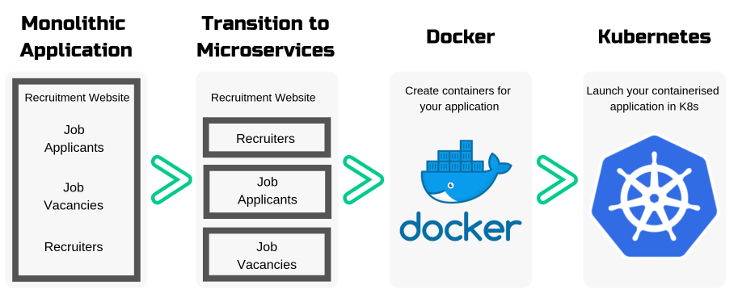
</p>

<div align="right">
    <b><a href="#">↥ back to top</a></b>
</div>

## Q. ***What is a node in Kubernetes?***

A node is the smallest fundamental unit of computing hardware. It represents a single machine in a cluster, which could be a physical machine in a data center or a virtual machine from a cloud provider. Each machine can substitute any other machine in a Kubernetes cluster. The master in Kubernetes controls the nodes that have containers.

<p align="center">
  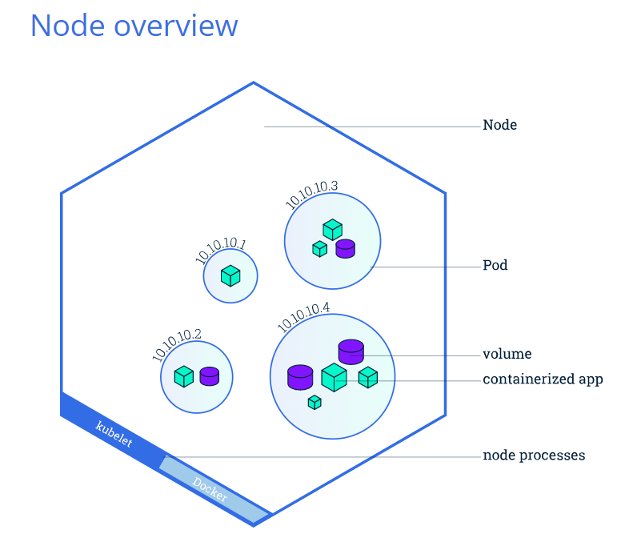
</p>

<div align="right">
    <b><a href="#">↥ back to top</a></b>
</div>

## Q. ***What are pods in Kubernetes?***

Pods are the smallest deployable units of computing that you can create and manage in Kubernetes.

A Pod is a group of one or more containers, with shared storage and network resources, and a specification for how to run the containers. Containers in the same pod share a local network and the same resources, allowing them to easily communicate with other containers in the same pod as if they were on the same machine while at the same time maintaining a degree of isolation.

**Example:** The following is an example of a Pod which consists of a container running the image `nginx:1.14.2`.

```yaml
# pods/simple-pod.yaml
apiVersion: v1
kind: Pod
metadata:
  name: nginx
spec:
  containers:
  - name: nginx
    image: nginx:1.14.2
    ports:
    - containerPort: 80
```

<div align="right">
    <b><a href="#">↥ back to top</a></b>
</div>

## Q. ***What is a Kubernetes deployment?***

A Kubernetes deployment is a resource object in Kubernetes that provides declarative updates to applications. A deployment allows you to describe an application\'s life cycle, such as which images to use for the app, the number of pods there should be, and the way in which they should be updated.

**Example:** The following is an example of a Deployment. It creates a ReplicaSet to bring up three nginx Pods:

```yaml
# controllers/nginx-deployment.yaml
apiVersion: apps/v1
kind: Deployment
metadata:
  name: nginx-deployment
  labels:
    app: nginx
spec:
  replicas: 3
  selector:
    matchLabels:
      app: nginx
  template:
    metadata:
      labels:
        app: nginx
    spec:
      containers:
      - name: nginx
        image: nginx:1.14.2
        ports:
        - containerPort: 80
```

<div align="right">
    <b><a href="#">↥ back to top</a></b>
</div>

## Q. ***Explain the use case of Kubernetes deployment?***

The following are typical use cases for Deployments:

* Create a Deployment to rollout a ReplicaSet. The ReplicaSet creates Pods in the background. Check the status of the rollout to see if it succeeds or not.
* Declare the new state of the Pods by updating the PodTemplateSpec of the Deployment. A new ReplicaSet is created and the Deployment manages moving the Pods from the old ReplicaSet to the new one at a controlled rate. Each new ReplicaSet updates the revision of the Deployment.
* Rollback to an earlier Deployment revision if the current state of the Deployment is not stable. Each rollback updates the revision of the Deployment.
* Scale up the Deployment to facilitate more load.
* Pause the Deployment to apply multiple fixes to its PodTemplateSpec and then resume it to start a new rollout.
* Use the status of the Deployment as an indicator that a rollout has stuck.
* Clean up older ReplicaSets that you don't need anymore

<div align="right">
    <b><a href="#">↥ back to top</a></b>
</div>

## Q. ***What is the difference between a pod and a deployment?***

A pod is the core building block for running applications in a Kubernetes cluster; a deployment is a management tool used to control the way pods behave.

Both Pod and Deployment are full-fledged objects in the Kubernetes API. Deployment manages creating Pods by means of ReplicaSets. What it boils down to is that Deployment will create Pods with spec taken from the template. It is rather unlikely that you will ever need to create Pods directly for a production use-case.

<div align="right">
    <b><a href="#">↥ back to top</a></b>
</div>

## Q. ***What are Kubernetes Services?***

A Kubernetes Service is an abstraction which defines a logical set of Pods running somewhere in your cluster, that all provide the same functionality. When created, each Service is assigned a unique IP address (also called clusterIP). This address is tied to the lifespan of the Service, and will not change while the Service is alive.

Pods can be configured to talk to the Service, and know that communication to the Service will be automatically load-balanced out to some pod that is a member of the Service.

**Example:**

```yaml
apiVersion: v1
kind: Service
metadata:
  name: my-service
spec:
  selector:
    app: MyApp
  ports:
    - protocol: TCP
      port: 80
      targetPort: 9376
```

This specification creates a new Service object named "my-service", which targets TCP port 9376 on any Pod with the app=MyApp label.

<div align="right">
    <b><a href="#">↥ back to top</a></b>
</div>

## Q. ***What is replicaset in kubernetes?***

A ReplicaSet\'s purpose is to maintain a stable set of replica Pods running at any given time. As such, it is often used to guarantee the availability of a specified number of identical Pods.

**Example:**

```yaml
# controllers/frontend.yaml
apiVersion: apps/v1
kind: ReplicaSet
metadata:
  name: frontend
  labels:
    app: guestbook
    tier: frontend
spec:
  # modify replicas according to your case
  replicas: 3
  selector:
    matchLabels:
      tier: frontend
  template:
    metadata:
      labels:
        tier: frontend
    spec:
      containers:
      - name: php-redis
        image: gcr.io/google_samples/gb-frontend:v3
```

Saving this manifest into frontend.yaml and submitting it to a Kubernetes cluster will create the defined ReplicaSet and the Pods that it manages.

```bash
kubectl apply -f https://kubernetes.io/examples/controllers/frontend.yaml

# Get the current ReplicaSets deployed:
kubectl get rs
```

<div align="right">
    <b><a href="#">↥ back to top</a></b>
</div>

## Q. ***What are clusters in Kubernetes?***

Kubernetes cluster is a set of nodes used for running containerized applications, so when you are running Kubernetes, you are running a cluster. A cluster contains a control plane & one or maybe more than one compute machines/nodes.

* The control plane is used to maintain the desired state of the cluster, such as which applications are running or which container images they use.
* Whereas, the nodes run the applications and the workloads.

Clusters are the heart of Kubernetes that gives the ability to schedule and run the containers across a group of machines - physical, virtual, on-premise, or in the cloud. Kubernetes containers aren\'t tied to any particular machines, they are abstracted across the cluster.

<div align="right">
    <b><a href="#">↥ back to top</a></b>
</div>

## Q. ***What are Daemon sets?***

A Daemon set is a set of pods that runs only once on a host. They are used for host layer attributes like a network or for monitoring a network, which you may not need to run on a host more than once.

<div align="right">
    <b><a href="#">↥ back to top</a></b>
</div>

## Q. ***What is Heapster in Kubernetes?***

A Heapster is a performance monitoring and metrics collection system for data collected by the Kublet. This aggregator is natively supported and runs like any other pod within a Kubernetes cluster, which allows it to discover and query usage data from all nodes within the cluster.

<p align="center">
  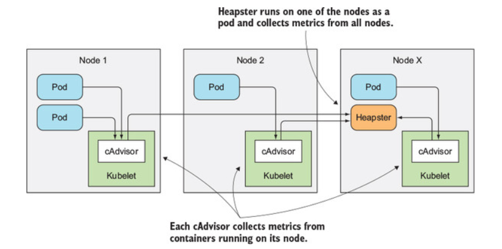
</p>

<div align="right">
    <b><a href="#">↥ back to top</a></b>
</div>

## Q. ***What is a Namespace in Kubernetes?***

Namespaces are used for dividing cluster resources between multiple users. They are meant for environments where there are many users spread across projects or teams and provide a scope of resources.

<p align="center">
  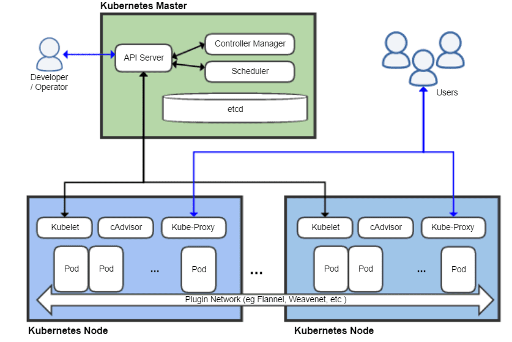
</p>

**Example:**

```yaml
// Get Kubernetes Namespace
kubectl get namespace

// Output
NAME                   STATUS   AGE
default                Active   24h
kube-node-lease        Active   24h
kube-public            Active   24h
kube-system            Active   24h
kubernetes-dashboard   Active   23h
```

<div align="right">
    <b><a href="#">↥ back to top</a></b>
</div>

## Q. ***Why use namespaces?***

While using the default namespace alone, it becomes hard over time to get an overview of all the applications you can manage in your cluster. Namespaces make it easier to organize the applications into groups that make sense, like a namespace of all the monitoring applications and a namespace for all the security applications, etc.

Namespaces can also be useful for managing Blue/Green environments where each namespace can include a different version of an app and also share resources that are in other namespaces (namespaces like logging, monitoring, etc.).

Another use case for namespaces is one cluster with multiple teams. When multiple teams use the same cluster, they might end up stepping on each other\'s toes. For example, if they end up creating an app with the same name it means one of the teams overrides the app of the other team because there can\'t be two apps in Kubernetes with the same name (in the same namespace).

<div align="right">
    <b><a href="#">↥ back to top</a></b>
</div>

## Q. ***What is the Kubernetes controller manager?***

In Kubernetes, different methods are operating on the master node, and they are accumulated together as the Kubernetes Controller Manager. It is a daemon which installs regulators, including the given below:

* Replication Controller: Maintains pods for each replication object
* Node Controller: Manages the status, mainly, making, refreshing and erasing nodes
* Endpoint controller: Maintain the endpoint objects (pods and administrations)
* Administration record and token regulator: Concerned with the default records and API access tokens for new namespaces

<div align="right">
    <b><a href="#">↥ back to top</a></b>
</div>

## Q. ***What are the types of controller managers?***

The primary controller managers that can run on the master node are the endpoints controller, service accounts controller, namespace controller, node controller, token controller, and replication controller.

<div align="right">
    <b><a href="#">↥ back to top</a></b>
</div>

## Q. ***What is ETCD in Kubernetes?***

Kubernetes uses etcd as a distributed key-value store for all of its data, including metadata and configuration data, and allows nodes in Kubernetes clusters to read and write data. Although etcd was purposely built for CoreOS, it also works on a variety of operating systems (e.g., Linux, BSB, and OS X) because it is open-source. Etcd represents the state of a cluster at a specific moment in time and is a canonical hub for state management and cluster coordination of a Kubernetes cluster.

<p align="center">
  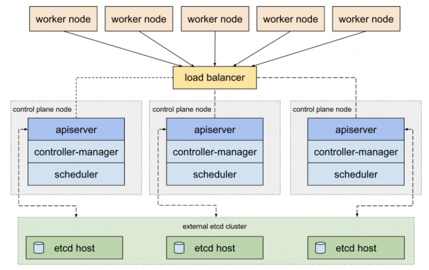
</p>

<div align="right">
    <b><a href="#">↥ back to top</a></b>
</div>

## Q. ***What is ClusterIP?***

The ClusterIP is the default Kubernetes service that provides a service inside a cluster (with no external access) that other apps inside your cluster can access.

<div align="right">
    <b><a href="#">↥ back to top</a></b>
</div>

## Q. ***What is NodePort?***

The NodePort service is the most fundamental way to get external traffic directly to your service. It opens a specific port on all Nodes and forwards any traffic sent to this port to the service.

<p align="center">
  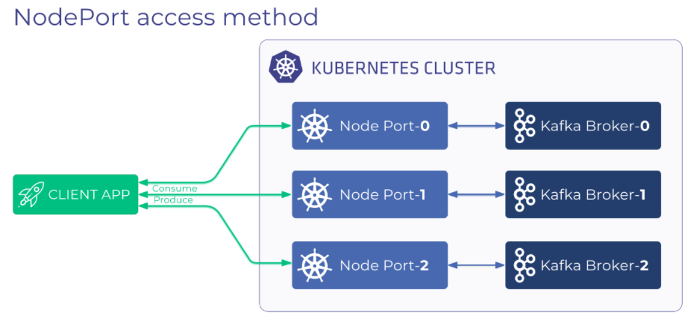
</p>

<div align="right">
    <b><a href="#">↥ back to top</a></b>
</div>

## Q. ***What is a headless service?***

A headless service is used to interface with service discovery mechanisms without being tied to a ClusterIP, therefore allowing you to directly reach pods without having to access them through a proxy. It is useful when neither load balancing nor a single Service IP is required.

<div align="right">
    <b><a href="#">↥ back to top</a></b>
</div>

## Q. ***What is Kubelet?***

The kubelet is a service agent that controls and maintains a set of pods by watching for pod specs through the Kubernetes API server. It preserves the pod lifecycle by ensuring that a given set of containers are all running as they should. The kubelet runs on each node and enables the communication between the master and slave nodes.

<div align="right">
    <b><a href="#">↥ back to top</a></b>
</div>

## Q. ***What is the Load Balancer in Kubernetes?***

<p align="center">
  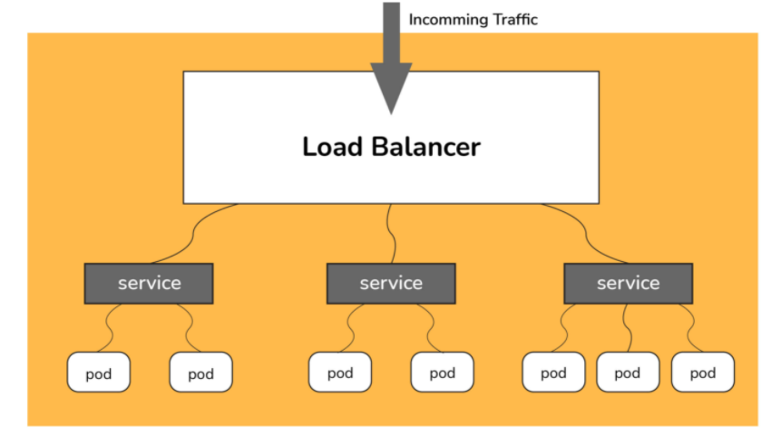
</p>

A load balancer gives a standard method to convey network traffic among various backend administrations, subsequently boosting adaptability. Contingent upon the workplace, there can be two kinds of load balancer, Internal or External. The Internal Load Balancer can naturally adjust the load and distribute the necessary configuration to the pods. Then again, the External Load Balancer directs the outside load traffic to the backend pods. In Kubernetes, the two load adjusting techniques work through the kube-proxy highlight.

<div align="right">
    <b><a href="#">↥ back to top</a></b>
</div>

## Q. ***What is Kubectl?***

Kubectl is a CLI (command-line interface) that is used to run commands against Kubernetes clusters. As such, it controls the Kubernetes cluster manager through different create and manage commands on the Kubernetes component

<div align="right">
    <b><a href="#">↥ back to top</a></b>
</div>

## Q. ***What is Kube-proxy?***

Kube-proxy is an implementation of a load balancer and network proxy used to support service abstraction with other networking operations. Kube-proxy is responsible for directing traffic to the right container based on IP and the port number of incoming requests.

<div align="right">
    <b><a href="#">↥ back to top</a></b>
</div>

## Q. ***Can we put multiple containers inside a pod?***

Yes. A pod that contains one container refers to a single container pod and it is the most common kubernetes use case. A pod that contains Multiple co-related containers refers to a multi-container pod.

<div align="right">
    <b><a href="#">↥ back to top</a></b>
</div>

## Q. ***Name some container patterns you come across or use?***

1. Init Container Pattern
2. Sidecar Container Pattern
3. Adapter Container Pattern
4. Ambassador Container Pattern

<div align="right">
    <b><a href="#">↥ back to top</a></b>
</div>

## Q. ***What is Init Container Pattern?***

Init Containers are the containers that should run and complete before the startup of the main container in the pod. It provides a separate lifecycle for the initialization so that it enables separation of concerns in the applications.

All the init Containers will be executed sequentially and if there is an error in the Init container the pod will be restarted which means all the Init containers are executed again. So, it\'s better to design your Init container as simple, quick, and Idompodent.

**Example:**

```yaml
apiVersion: v1
kind: Pod
metadata:
  name: init-container-demo
spec:
  containers:
  - name: nginx
    image: nginx
    ports:
    - containerPort: 80
    volumeMounts:
    - name: workdir
      mountPath: /usr/share/nginx/html
  # These containers are run during pod initialization
  initContainers:
  - name: busybox
    image: busybox
    command: ["/bin/sh"]
    args: ["-c", "echo '<html><h1>Hi I am from Init container</h1><html>' >> /work-dir/index.html"]
    volumeMounts:
    - name: workdir
      mountPath: "/work-dir"
  dnsPolicy: Default
  volumes:
  - name: workdir
    emptyDir: {}
```

<div align="right">
    <b><a href="#">↥ back to top</a></b>
</div>

## Q. ***When do you use Init Container Pattern?***

* You can use this pattern where your application or main containers need some prerequisites such as installing some software, database setup, permissions on the file system before starting.
* You can use this pattern where you want to delay the start of the main containers.

<div align="right">
    <b><a href="#">↥ back to top</a></b>
</div>

## Q. ***How do you configure resource limits for the Init Container Pattern?***

Configuring resource limits is very important when it comes to Init containers. The main point we need to understand here is Init containers run first before the start of the main container so when you configure resource limits for the pod you have to take that into consideration.

* The highest init container resource limits (since Init containers run sequentially)
* The sum of all the resource limits of the main containers (Since all the application containers run in parallel)

<div align="right">
    <b><a href="#">↥ back to top</a></b>
</div>

## Q. ***What is Sidecar Container Design?***

Sidecar containers are the containers that should run along with the main container in the pod. This sidecar pattern extends and enhances the functionality of current containers without changing it.

Imagine that you have the pod with a single container working very well and you want to add some functionality to the current container without touching or changing, how can you add the additional functionality or extending the current functionality? This sidecar container pattern really helps exactly in that situation.

All the Containers will be executed parallelly and the whole functionality works only if both types of containers are running successfully. Most of the time these sidecar containers are simple and small that consume fewer resources than the main container.

**Example:**

```yaml
apiVersion: v1
kind: Pod
metadata:
  name: sidecar-container-demo
spec:
  containers:
  - image: busybox
    command: ["/bin/sh"]
    args: ["-c", "while true; do echo echo $(date -u) 'Hi I am from Sidecar container' >> /var/log/index.html; sleep 5;done"]
    name: sidecar-container
    resources: {}
    volumeMounts:
    - name: var-logs
      mountPath: /var/log
  - image: nginx
    name: main-container
    resources: {}
    ports:
      - containerPort: 80
    volumeMounts:
    - name: var-logs
      mountPath: /usr/share/nginx/html
  dnsPolicy: Default
  volumes:
  - name: var-logs
    emptyDir: {}
```

<div align="right">
    <b><a href="#">↥ back to top</a></b>
</div>

## Q. ***When do you use Sidecar Container Pattern?***

* Whenever you want to extend the functionality of the existing single container pod without touching the existing one.
* Whenever you want to enhance the functionality of the existing single container pod without touching the existing one.
* You can use this pattern to synchronize the main container code with the git server pull.
* You can use this pattern for sending log events to the external server.
* You can use this pattern for network-related tasks.

<div align="right">
    <b><a href="#">↥ back to top</a></b>
</div>

## Q. ***How do you configure resource limits for the Sidecar Container Pattern?***

Configuring resource limits is very important when it comes to Sidecar containers. The main point we need to understand here is All the containers run in parallel so when you configure resource limits for the pod you have to take that into consideration.

* The sum of all the resource limits of the main containers as well as sidecar containers (Since all the containers run in parallel)

<div align="right">
    <b><a href="#">↥ back to top</a></b>
</div>

## Q. ***What is Adapter Container Pattern?***

There are so many applications that are heterogeneous in nature which means they don\'t contain the same interface or not consistent with other systems. This pattern extends and enhances the functionality of current containers without changing it as the sidecar container pattern.

Imagine that you have the pod with a single container working very well but, it doesn\'t have the same interface with other systems to integrate or work with it. How can you make this container to have a unified interface with a standardized format so that other systems can to your container? This adapter container pattern really helps exactly in that situation.

All the Containers will be executed parallelly and the whole functionality works only if both types of containers are running successfully. Most of the time these adapter containers are simple and small that consume fewer resources than the main container.

**Example:**

```yaml
apiVersion: v1
kind: Pod
metadata:
  name: adapter-container-demo
spec:
  containers:
  - image: busybox
    command: ["/bin/sh"]
    args: ["-c", "while true; do echo $(date -u)'#This is log' >> /var/log/file.log; sleep 5;done"]
    name: main-container
    resources: {}
    volumeMounts:
    - name: var-logs
      mountPath: /var/log
  - image: bbachin1/adapter-node-server
    name: adapter-container
    imagePullPolicy: Always
    resources: {}
    ports:
      - containerPort: 3080
    volumeMounts:
    - name: var-logs
      mountPath: /var/log
  dnsPolicy: Default
  volumes:
  - name: var-logs
    emptyDir: {}
```

<div align="right">
    <b><a href="#">↥ back to top</a></b>
</div>

## Q. ***When do you use Adapter Container Pattern?***

* Whenever you want to extend the functionality of the existing single container pod without touching the existing one.
* Whenever you want to enhance the functionality of the existing single container pod without touching the existing one.
* Whenever there is a need to convert or standardize the format for the rest of the systems.

<div align="right">
    <b><a href="#">↥ back to top</a></b>
</div>

## Q. ***How do you configure resource limits for the Adapter Container Pattern?***

Configuring resource limits is very important when it comes to Adapter containers. The main point we need to understand here is All the containers run in parallel so when you configure resource limits for the pod you have to take that into consideration.

* The sum of all the resource limits of the main containers as well as adapter containers (Since all the containers run in parallel)

<div align="right">
    <b><a href="#">↥ back to top</a></b>
</div>

## Q. ***What is Ambassador Container Pattern?***

The Ambassador container is a special type of sidecar container which simplifies accessing services outside the Pod. When you are running applications on kubernetes it\'s a high chance that you should access the data from the external services. The Ambassador container hides the complexity and provides the uniform interface to access these external services.

Imagine that you have the pod with one container running successfully but, you need to access external services. But, these external services are dynamic in nature or difficult to access. Sometimes there is a different format that external service returns. There are some other reasons as well and you don\'t want to handle this complexity in the main container. So, we use the Ambassador containers to handle these kinds of scenarios.

All the Containers will be executed parallelly and the whole functionality works only if both types of containers are running successfully. Most of the time these ambassador containers are simple and small that consume fewer resources than the main container.

**Example:**

```yaml
apiVersion: v1
kind: Pod
metadata:
  name: ambassador-container-demo
spec:
  containers:
  - image: bbachin1/main-container
    name: main-container
    imagePullPolicy: Always
    resources: {}
    ports:
      - containerPort: 9000
  - image: bbachin1/nginx-server-proxy
    name: ambassador-container
    imagePullPolicy: Always
    resources: {}
    ports:
      - containerPort: 3000
  dnsPolicy: Default
```

<div align="right">
    <b><a href="#">↥ back to top</a></b>
</div>

## Q. ***When do you use Ambassador Container Pattern?***

* Whenever you want to hide the complexity from the main container such as service discovery.
* Whenever your containerized services want to talk to external services you can use this pattern to handle the request and response for these services.
* Whenever there is a need to convert or standardize the format of external services responses.

<div align="right">
    <b><a href="#">↥ back to top</a></b>
</div>

## Q. ***How do you configure resource limits for the Ambassador Container Pattern?***

Configuring resource limits is very important when it comes to Ambassador containers. The main point we need to understand here is All the containers run in parallel so when you configure resource limits for the pod you have to take that into consideration.

* The sum of all the resource limits of the main containers as well as ambassador containers (Since all the containers run in parallel)

<div align="right">
    <b><a href="#">↥ back to top</a></b>
</div>

## Q. ***Point out the tools which are utilized for container monitoring?***

Tools which are utilized for container monitoring are:

* [Grafana](https://grafana.com/)
* [cAdvisor](https://github.com/google/cadvisor)
* [Heapster](https://github.com/kubernetes-retired/heapster)
* [InfluxDB](https://www.influxdata.com/)
* [Prometheus](https://prometheus.io/docs/guides/cadvisor/)

<div align="right">
    <b><a href="#">↥ back to top</a></b>
</div>

## Q. ***Disadvantages of Kubernetes***

* Kubernetes dashboard isn\'t as useful as it ought to be
* Security isn\'t viable.
* It is intricate and can diminish profitability
* Kubernetes is more costlier than its other options.

<div align="right">
    <b><a href="#">↥ back to top</a></b>
</div>

## Q. ***Why use Kubernetes?***

Kubernetes is utilized on the grounds that:

* It causes you to evade vendor lock issues as it can utilize any vendor explicit APIs or administrations aside from where Kubernetes gives a reflection, e.g., load balancer and capacity.
* Kubernetes can run on-premises exposed metal, OpenStack, Azure, public clouds Google, AWS, and so on.
* It will empower applications which should be delivered and refreshed with no vacation. 
* Kubernetes permits you to guarantee those containerized applications operate where and when you need and assist you with discovering assets and apparatuses which you need to work.

<div align="right">
    <b><a href="#">↥ back to top</a></b>
</div>

## Q. ***What is the function of clusters in Kubernetes?***

Kubernetes permits you to authorize the necessary state management by taking care of cluster services of a particular setup. At that point, these cluster administrations operate that configuration in the foundation. The accompanying steps are associated with the method: The deployment document includes all the setups to be taken care of into the cluster administrations. The deployment document is taken care of into the API. Presently, the cluster services plan the pods in the climate. Cluster benefits likewise guarantee that the correct number of pods are operating. Along these lines, the Kubernetes cluster is basically composed of the API, the worker nodes, and the Kubelet cycle of the nodes.

<p align="center">
  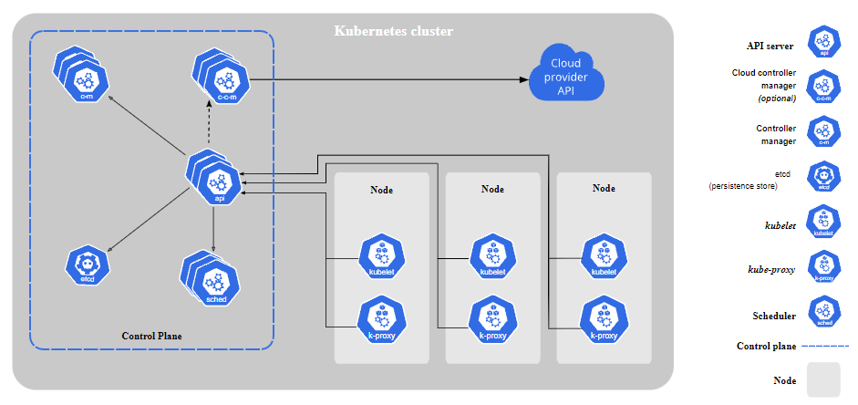
</p>

<div align="right">
    <b><a href="#">↥ back to top</a></b>
</div>

## Q. ***Characteristics of Kubernetes***

The characteristics of Kubernetes are:

* Self-Healing Capabilities
* Automated Scheduling
* Application-centric management
* You could make predictable infrastructure
* Automated rollouts & rollback
* Offers a higher density of resource utilization
* Horizontal Scaling & Load Balancing
* Provides enterprise-ready features
* Auto-scalable infrastructure
* Provides environment consistency for testing, development, and production.
* Infrastructure is lightly coupled to each segment and can act as a separate unit.

<div align="right">
    <b><a href="#">↥ back to top</a></b>
</div>

## Q. ***Define Ingress network***

<p align="center">
  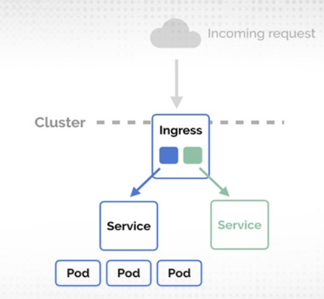
</p>

Ingress network is an assortment of rules which goes about as a section highlighting the Kubernetes cluster. This permits inbound associations that can be arranged to give benefits remotely through load balance traffic, reachable URLs, or by providing name-based virtual facilitating. In this way, Ingress is an API object which oversees outer admittance to the services in a cluster, generally by HTTP, and is the most remarkable method of uncovering administration.

<div align="right">
    <b><a href="#">↥ back to top</a></b>
</div>

## Q. ***List the uses of GKE***

GKE (Google Kubernetes Engine) uses are given below: 

* It very well may be utilized to make docker container clusters
* Resize application regulators
* Update and redesign the clusters of container
* Investigate clusters of the container.
* GKE can be utilized to make a replication regulator, occupations, load balancer, administrations, container pods

<div align="right">
    <b><a href="#">↥ back to top</a></b>
</div>

## Q. ***Explain the main components of Kubernetes architecture?***

The two primary components include the master node and the worker node. Each of its components has individual components in them. The two segments have numerous in-fabricated administrations inside them. For instance, the master part has the kube-scheduler, kube-controller-manager, etcd, and kube-apiserver. The worker node has administrations like kubelet, container runtime, and kube-proxy functioning on every node.

<div align="right">
    <b><a href="#">↥ back to top</a></b>
</div>

## Q. ***How do we control the resource usage of POD?***

With the use of limit and request resource usage of a POD can be controlled.

Request: The number of resources being requested for a container. If a container exceeds its request for resources, it can be throttled back down to its request.

Limit: An upper cap on the resources a single container can use. If it tries to exceed this predefined limit it can be terminated if K8\'s decides that another container needs these resources. If you are sensitive towards pod restarts, it makes sense to have the sum of all container resource limits equal to or less than the total resource capacity for your cluster.

**Example:**

```yaml
apiVersion: v1
kind: Pod
metadata:
 name: demo
spec:
 containers:
 - name: example1
 image:example/example1
 resources:
   requests:
     memory: "_Mi"
     cpu: "_m"
   limits:
     memory: "_Mi"
     cpu: "_m"
```

<div align="right">
    <b><a href="#">↥ back to top</a></b>
</div>

## Q. ***What are the various K8s services running on nodes and describe the role of each service?***

Mainly K8 cluster consists of two types of nodes, executor and master.

**Executor node:** (This runs on master node)

* Kube-proxy: This service is responsible for the communication of pods within the cluster and to the outside network, which runs on every node. This service is responsible to maintain network protocols when your pod establishes a network communication.
* kubelet: Each node has a running kubelet service that updates the running node accordingly with the configuration(YAML or JSON) file.
NOTE: kubelet service is only for containers created by Kubernetes.

**Master services:**

* Kube-apiserver: Master API service which acts as an entry point to K8 cluster.
* Kube-scheduler: Schedule PODs according to available resources on executor nodes.
* Kube-controller-manager:  is a control loop that watches the shared state of the cluster through the apiserver and makes changes attempting to move the current state towards the desired stable state

<div align="right">
    <b><a href="#">↥ back to top</a></b>
</div>

## Q. ***What is PDB (Pod Disruption Budget)?***

A Kubernetes administrator can create a deployment of a kind: PodDisruptionBudget for high availability of the application, it makes sure that the minimum number is running pods are respected as mentioned by the attribute minAvailable spec file. This is useful while performing a drain where the drain will halt until the PDB is respected to ensure the High Availability(HA) of the application. The following spec file also shows minAvailable as 2 which implies the minimum number of an available pod (even after the election).

**Example:** YAML Config using minAvailable

```yaml
apiVersion: policy/v1beta1
kind: PodDisruptionBudget
metadata:
 name: zk-pdb
spec:
 minAvailable: 2
 selector:
   matchLabels:
     app: zookeeper
```

<div align="right">
    <b><a href="#">↥ back to top</a></b>
</div>

## Q. ***What are the various things that can be done to increase Kubernetes security?***

By default, POD can communicate with any other POD, we can set up network policies to limit this communication between the PODs.

* RBAC (Role-based access control) to narrow down the permissions.
* Use namespaces to establish security boundaries.
* Set the admission control policies to avoid running the privileged containers.
* Turn on audit logging.

<div align="right">
    <b><a href="#">↥ back to top</a></b>
</div>

## Q. ***How to monitor the Kubernetes cluster?***

**[Prometheus](https://prometheus.io/)** is used for Kubernetes cluster monitoring. The Prometheus ecosystem consists of multiple components.

* Mainly Prometheus server which scrapes and stores time-series data.
* Client libraries for instrumenting application code.
* Push gateway for supporting short-lived jobs.
* Special-purpose exporters for services like StatsD, HAProxy, Graphite, etc.
* An alert manager to handle alerts on various support tools.

<div align="right">
    <b><a href="#">↥ back to top</a></b>
</div>

## Q. ***How to get the central logs from POD?***

This architecture depends upon the application and many other factors. Following are the common logging patterns

* Node level logging agent.
* Streaming sidecar container.
* Sidecar container with the logging agent.
* Export logs directly from the application.

<div align="right">
    <b><a href="#">↥ back to top</a></b>
</div>

## Q. ***How to turn the service defined below in the spec into an external one?***

Adding type: LoadBalancer and nodePort as follows:

```yaml
spec:
 selector:
   app: some-app
 type: LoadBalancer
 ports:
   - protocol: UDP
     port: 8080
     targetPort: 8080
     nodePort: 32412
```

<div align="right">
    <b><a href="#">↥ back to top</a></b>
</div>

## Q. ***How to configure TLS with Ingress?***

Add tls and secretName entries.

```yaml
spec:
 tls:
 - hosts:
   - some_app.com
   secretName: someapp-secret-tls
```

<div align="right">
    <b><a href="#">↥ back to top</a></b>
</div>

## Q. ***What is a Kubernetes Operator?***

Operators are software extensions to K8s which make use of custom resources to manage applications and their components. Operators follow Kubernetes principles, notably the control loop.

<div align="right">
    <b><a href="#">↥ back to top</a></b>
</div>

## Q. ***Why do we need Operators?***

The process of managing applications in Kubernetes isn't as straightforward as managing stateless applications, where reaching the desired status and upgrades are both handled the same way for every replica. In stateful applications, upgrading each replica might require different handling due to the stateful nature of the app, each replica might be in a different status. As a result, we often need a human operator to manage stateful applications. Kubernetes Operator is supposed to assist with this.

This will also help with automating a standard process on multiple Kubernetes clusters

<div align="right">
    <b><a href="#">↥ back to top</a></b>
</div>

## Q. ***What difference do you find between Docker Swarm and Kubernetes?***

|Parameters    | Kubernetes                 | Docker Swarm
|--------------|----------------------------|---------------------|
| GUI          | Kubernetes Dashboard is the GUI   | Has no GUI
|Installation & cluster configuration| Setups are quite complicated but the cluster is robust.| Setup is easy but the cluster is not robust.|
|Auto-scaling  |Can do auto-scaling. | Cannot do auto-scaling.|
|Scalability   |Scales fast.         |Scales 5 times faster than Kubernetes.
|Load Balancing|Manual support needed for load balancing traffic between containers & pods.|Does auto load balancing of traffic between containers in clusters.|
|Data volumes |Can only share storage volumes with containers in the same pod.|Can share storage volumes with other containers.|
|Rolling updates and rollbacks|Does rolling updates and automatic rollbacks.|Can do rolling updates but no automatic rollbacks.|
|Logging and monitoring |Has in-built tools to perform logging and monitoring.|Requires 3rd party tools like ELK stack to do logging and monitoring.|

<div align="right">
    <b><a href="#">↥ back to top</a></b>
</div>

## Q. ***What difference do you find between deploying applications on the host and containers?***

<p align="center">
  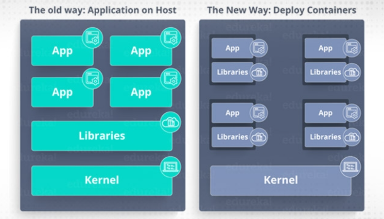
</p>

**When you deploy the application on hosts:**

* There will be an operating system and that operating system will have a kernel which again will have diverse libraries (installed on the operating system) that are required for the application.
* In this kind of framework, you can have several applications and you will see all the applications sharing the libraries present in the operating system.

**When you deploy an application on the container:**

* In this architecture, you will have a kernel which will be the only common thing between all the applications.
* Here you will see every application has their necessary libraries and binaries isolated from the rest of the system, which cannot be approached by any other application.
* Like if one app needs access to Python, that particular app will get it, if the particular application needs access to Java, then only that particular app will have access to Java.

<div align="right">
    <b><a href="#">↥ back to top</a></b>
</div>

## Q. ***What is Minikube?***

Minikube is a tool used for easy running Kubernetes locally, it runs a single-code Kubernetes cluster within a virtual machine.

<div align="right">
    <b><a href="#">↥ back to top</a></b>
</div>

## Q. ***How Kubernetes simplifies the containerized Deployment***

A cluster of containers of applications running across multiple hosts requires communications. To make the communication happen, we require something that can scale, balance, and monitor the containers. As Kubernetes is an anti-agnostic tool that can run on any public to a private provider, it is the best choice that can simplify the containerized deployment.

<div align="right">
    <b><a href="#">↥ back to top</a></b>
</div>

## Q. ***What is the role of Kube-apiserver and Kube-scheduler?***

**Kube-Episerver:**

* It follows the scale-out architecture & is the front-end of the master node control panel. 
* Exposes all the APIs of the Kubernetes Master node components and establishes communication between the Kubernetes Node and the Kubernetes master components.

**Kube-scheduler:**

* It does distribution and management of workload on the worker nodes. 
* It opts the most suitable node to run the unscheduled pod (based on resource requirements) & keeps a track on the resource utilization.
* It makes sure that no workload is scheduled on already full nodes.

<div align="right">
    <b><a href="#">↥ back to top</a></b>
</div>

## Q. ***How do master nodes in Kubernetes work?***

* Kubernetes master controls the nodes, and nodes have the containers in it.
* The individual containers are contained inside the pods and each pod can contain various numbers of containers based on the requirements & configuration.
* So when pods have to be deployed, they have to be deployed either using the interface or CLI (command line interface).
* These pods are scheduled on the nodes and on the basis of resource requirements, the pods are allocated to these nodes.
* Kube-apiserver (which is master node services) ensures that there is a communication between the Kubernetes node and master components.

<div align="right">
    <b><a href="#">↥ back to top</a></b>
</div>

## Q. ***What are the different types of services in Kubernetes?***

There are four types of services in Kubernetes:

* **Cluster IP** - Kubernetes Service is an abstraction defining a logical set of Pods running somewhere in your cluster, all providing the same functionality. When created, each Service is given a unique IP address which is also called clusterIP.
* **Node Port** - A NodePort is an open port that is on every node of your cluster. Kubernetes routes incoming traffic transparently on the NodePort to your service, even if the application is running on a different node.
* **Load Balancer** - It exposes the service externally using the load balancer of the cloud provider. Services to which the load balancer will route are automatically created.
* **External name** - It exposes the Service by using an arbitrary name (specified by ExternalName in the spec) by returning a CNAME record with its value.

<div align="right">
    <b><a href="#">↥ back to top</a></b>
</div>

## Q. ***What do you understand about Cloud controller managers?***

Cloud Controller Manager has to ensure consistent storage, abstract the cloud-specific code from the Kubernetes specific code, network routing, and manage the communication with the cloud services. 

All these can be split into different containers (it depends on which cloud platform you are using) and this further allows the Kubernetes and cloud vendors code to get developed without creating any inter-dependency. So, the cloud vendor develops its code and connects with the cloud-controller-manager while running the Kubernetes.

There are 4 types of cloud controller managers:

* **Node controller** - Ensures that the node is deleted as soon it is stopped.
* **Volume controller** - Manages the storage and interacts with the cloud provider to orchestrate volume.
* **Route Controller** - Manages traffic routes in the underlying cloud infrastructures.
* **Service Controller** - It ensures the management of cloud provider load balancers.

<div align="right">
    <b><a href="#">↥ back to top</a></b>
</div>

## Q. ***What is the difference between a replica set and a replication controller?***

Both replica set and replication controller ensure that the given number of pod replicas are running at a given time. But the only point of difference between them is, replica leverages set-based selectors, while the replication controller uses equity-based controllers.

**Selector-based Selectors:**

It filters the keys according to a set of values. The selector based selector locks for pods whose label is mentioned in the set.

**Equity-Based Selectors:**

It filters by both label keys and values. The equity-based selector looks for the pods that have the exact phrase as mentioned in the label.

<div align="right">
    <b><a href="#">↥ back to top</a></b>
</div>

## Q. ***What are federated clusters?***

The Multiple Kubernetes clusters can be controlled/managed as a single cluster with the help of federated clusters. You can generate multiple Kubernetes clusters within a data center/cloud and use federation clusters to control/manage all of them in one place.

The federated clusters can achieve this by doing the following two things. 

* **Cross cluster discovery** - Provides the ability to have DNS and Load Balancer with backends from all participating clusters.
* **Sync Resources across clusters** - Syncs resources across the clusters for deploying the same deployment set across multiple clusters.

<div align="right">
    <b><a href="#">↥ back to top</a></b>
</div>

## Q. ***What are the best security measures that you can take while using Kubernetes?***

Here are a few ways to ensure security while using Kubernetes:

* By restricting access to ETCD
* By applying security updates to the environment regularly
* By implementing network segmentation
* By logging everything on the producing environment
* By having continuous security vulnerability scanning
* By having a strict policy or protocol for resources
* By enabling auditing
* By defining resource quota
* By limiting direct access to Kubernetes nodes
* By using images from the authorized repository only

<div align="right">
    <b><a href="#">↥ back to top</a></b>
</div>

## Q. ***What are the main differences between the Docker Swarm and Kubernetes?***

Docker Swarm is Docker\'s native, open-source container orchestration platform that is used to cluster and schedule Docker containers. Swarm differs from Kubernetes in the following ways:

* Docker Swarm is more convenient to set up but doesn\'t have a robust cluster, while Kubernetes is more complicated to set up but the benefit of having the assurance of a robust cluster
* Docker Swarm can\'t do auto-scaling (as can Kubernetes); however, Docker scaling is five times faster than Kubernetes 
* Docker Swarm doesn\'t have a GUI; Kubernetes has a GUI in the form of a dashboard
* Docker Swarm does automatic load balancing of traffic between containers in a cluster, while Kubernetes requires manual intervention for load balancing such traffic  
* Docker requires third-party tools like ELK stack for logging and monitoring, while Kubernetes has integrated tools for the same 
Docker Swarm can share storage volumes with any container easily, while Kubernetes can only share storage volumes with containers in the same pod
* Docker can deploy rolling updates but can\'t deploy automatic rollbacks; Kubernetes can deploy rolling updates as well as automatic rollbacks

<div align="right">
    <b><a href="#">↥ back to top</a></b>
</div>

## Q. ***What are the types of secrets available in Kubernetes?***

Kubernetes provides several builtin types for some common usage scenarios. These types vary in terms of the validations performed and the constraints Kubernetes imposes on them.

|Builtin Type   |Usage               |
|---------------|--------------------|
|Opaque|arbitrary user-defined data  |
|kubernetes.io/service-account-token|service account token|
|kubernetes.io/dockercfg|serialized ~/.dockercfg file|
|kubernetes.io/dockerconfigjson|serialized ~/.docker/config.json file|
|kubernetes.io/basic-auth|credentials for basic authentication|
|kubernetes.io/ssh-auth|credentials for SSH authentication|
|kubernetes.io/tls|data for a TLS client or server|
|bootstrap.kubernetes.io/token|bootstrap token data|

<div align="right">
    <b><a href="#">↥ back to top</a></b>
</div>

## Q. ***How to use secrets in Kubernetes?***

Secrets can be defined as Kubernetes objects used to store sensitive data such as user name and passwords with encryption.

```yaml
apiVersion: v1
kind: Secret
metadata:
name: tomcat-pass
type: Opaque
data:
   password: <User Password>
   username: <User Name>
```

**Creating the Secret:**

```bash
$ kubectl create –f Secret.yaml
secrets/tomcat-pass

$ kubectl apply -k .
```

<div align="right">
    <b><a href="#">↥ back to top</a></b>
</div>

## Q. ***How to Create and Use ConfigMap with Kubernetes?***

A Kubernetes ConfigMap is an API object that allows you to store data as key-value pairs. Kubernetes pods can use ConfigMaps as configuration files, environment variables or command-line arguments.

ConfigMaps allow you to decouple environment-specific configurations from containers to make applications portable. However, they are not suitable for confidential data storage.

**Create a ConfigMap:**

```bash
kubectl create configmap <map-name> <data-source>
```

where `<map-name>` is the name you want to assign to the ConfigMap and `<data-source>` is the directory, file, or literal value to draw the data from. The name of a ConfigMap object must be a valid DNS subdomain name.

<div align="right">
    <b><a href="#">↥ back to top</a></b>
</div>

## Q. ***What is a Kubernetes StatefulSet?***

StatefulSet is the workload API object used to manage stateful applications. Manages the deployment and scaling of a set of Pods, and provides guarantees about the ordering and uniqueness of these Pods.

Like a Deployment, a StatefulSet manages Pods that are based on an identical container spec. Unlike a Deployment, a StatefulSet maintains a sticky identity for each of their Pods. These pods are created from the same spec, but are not interchangeable: each has a persistent identifier that it maintains across any rescheduling.

**Using StatefulSets:**

StatefulSets are valuable for applications that require one or more of the following.

* Stable, unique network identifiers.
* Stable, persistent storage.
* Ordered, graceful deployment and scaling.
* Ordered, automated rolling updates.

**Example:** The example below demonstrates the components of a StatefulSet.

```yaml
apiVersion: v1
kind: Service
metadata:
  name: nginx
  labels:
    app: nginx
spec:
  ports:
  - port: 80
    name: web
  clusterIP: None
  selector:
    app: nginx
---
apiVersion: apps/v1
kind: StatefulSet
metadata:
  name: web
spec:
  selector:
    matchLabels:
      app: nginx # has to match .spec.template.metadata.labels
  serviceName: "nginx"
  replicas: 3 # by default is 1
  template:
    metadata:
      labels:
        app: nginx # has to match .spec.selector.matchLabels
    spec:
      terminationGracePeriodSeconds: 10
      containers:
      - name: nginx
        image: k8s.gcr.io/nginx-slim:0.8
        ports:
        - containerPort: 80
          name: web
        volumeMounts:
        - name: www
          mountPath: /usr/share/nginx/html
  volumeClaimTemplates:
  - metadata:
      name: www
    spec:
      accessModes: [ "ReadWriteOnce" ]
      storageClassName: "my-storage-class"
      resources:
        requests:
          storage: 1Gi
```

<div align="right">
    <b><a href="#">↥ back to top</a></b>
</div>

## Q. ***What are levels of abstraction in Kubernetes?***

Deployments create and manage ReplicaSets, which create and manage Pods, which run on Nodes, which have a container runtime, which run the app code you put in your Docker image.

Here are the six layers of abstractions when running a workload in Kubernetes starting with the highest-level abstraction.

1. Deployment
2. ReplicaSet
3. Pod
4. Node Cluster
5. Node Processes
6. Docker Container

<p align="center">
  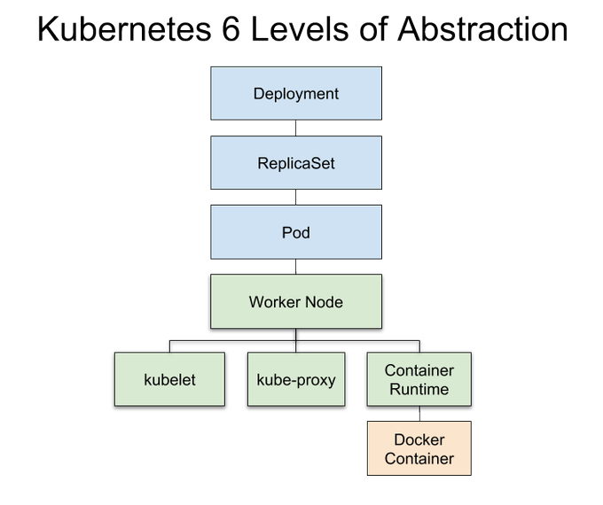
</p>

<div align="right">
    <b><a href="#">↥ back to top</a></b>
</div>

## Q. ***How to Configure Kubernetes for Rolling Update?***

One of the primary benefits of using a Deployment to control your pods is the ability to perform rolling updates. Rolling updates allow you to update the configuration of your pods gradually, and Deployments offer many options to control this process.

The deployment file properly configured for rolling updates should look like this:

```yaml
apiVersion: apps/v1
kind: Deployment
metadata:
  name: nginx-deployment
  labels:
    app: nginx
spec:
  replicas: 4
  selector:

    matchLabels:
      app: nginx
  minReadySeconds: 5
  strategy:
    type: RollingUpdate
    rollingUpdate:
      maxSurge: 1
      maxUnavailable: 1
  template:
    metadata:
      labels:
        app: nginx
    spec:
      containers:
      - name: nginx
        image: nginx:1.14.0

        ports:
        - containerPort: 80
        readinessProbe:
          httpGet:
            path: /
            port: 8080
            initialDelaySeconds: 5
            periodSeconds: 5
            successThreshold: 1
```

* **initialDelaySeconds** specifies how long the probe has to wait to start after the container starts.
* **periodSeconds** is the time between two probes. The default is **10** seconds, while the minimal value is **1** second.
* **successThreshold** is the minimum number of consecutive successful probes after a failed one for the entire process to be considered successful. The default and minimal values are both **1**.

```bash
kubectl apply -f nginx-text.yaml --record
```

There are three ways to perform rolling updates.

For example, to change the app image:

Option 1: You can use kubectl set to perform the action on the command line:

```bash
kubectl set image deployment nginx-deployment nginx=nginx:1.14.2 --record
```

Option 2: Alternatively, modify the image version in the spec.templates.spec.containers section of the yaml file. Then, use kubectl replace to perform the update:

```bash
kubectl replace -f nginx-test.yaml
```

Option 3: You can also use kubectl edit to edit the deployment directly:

```bash
kubectl edit deployment nginx-deployment --record
```

<div align="right">
    <b><a href="#">↥ back to top</a></b>
</div>

## Q. ***What is the difference between Docker Compose and Kubernetes?***

Docker (or specifically, the docker command) is used to manage individual containers, docker-compose is used to manage multi-container applications and Kubernetes is a container orchestration tool.

**Docker Compose:**

* Docker Compose is the declarative version of the docker cli
* It can start one or more containers
* It can create one or more networks and attach containers to them
* It can create one or more volumes and configure containers to mount them
* All of this is for use on a single host

**Kubernetes:**

* Kubernetes is a platform for managing containerized workloads and services, that facilitates both declarative configuration and automation.
* are fault-tolerant,
* can scale, and do this on-demand
* use resources optimally
* can discover other applications automatically, and communicate with each other
* can update/rollback without any downtime.

<div align="right">
    <b><a href="#">↥ back to top</a></b>
</div>

## Q. ***How to use local docker images with Minikube?***

To use an image without uploading it, you can follow these steps:

* Set the environment variables with `eval $(minikube docker-env)`
* Build the image with the Docker daemon of Minikube (eg `docker build -t my-image .`)
* Set the image in the pod spec like the build tag (eg `my-image`)
* Set the `imagePullPolicy` to `Never`, otherwise Kubernetes will try to download the image.

**Example:**

```bash
# Start minikube
minikube start

# Set docker env
eval $(minikube docker-env)             # unix shells
minikube docker-env | Invoke-Expression # PowerShell

# Build image
docker build -t foo:0.0.1 .

# Run in minikube
kubectl run hello-foo --image=foo:0.0.1 --image-pull-policy=Never

# Check that it's running
kubectl get pods
```

<div align="right">
    <b><a href="#">↥ back to top</a></b>
</div>

## Q. ***What is the difference between ClusterIP, NodePort and LoadBalancer service types in Kubernetes?***

**ClusterIP:**

A ClusterIP service is the default Kubernetes service. It gives you a service inside your cluster that other apps inside your cluster can access. There is no external access.

The YAML for a ClusterIP service looks like this:

```yaml
apiVersion: v1
kind: Service
metadata:  
  name: my-internal-service
spec:
  selector:    
    app: my-app
  type: ClusterIP
  ports:  
  - name: http
    port: 80
    targetPort: 80
    protocol: TCP
```

**NodePort:**

A NodePort service is the most primitive way to get external traffic directly to your service. NodePort, as the name implies, opens a specific port on all the Nodes (the VMs), and any traffic that is sent to this port is forwarded to the service.

The YAML for a NodePort service looks like this:

```yaml
apiVersion: v1
kind: Service
metadata:  
  name: my-nodeport-service
spec:
  selector:    
    app: my-app
  type: NodePort
  ports:  
  - name: http
    port: 80
    targetPort: 80
    nodePort: 30036
    protocol: TCP
```

**LoadBalancer:**

A LoadBalancer service is the standard way to expose a service to the internet. On GKE, this will spin up a Network Load Balancer that will give you a single IP address that will forward all traffic to your service.

The YAML for a LoadBalancer service looks like this:

```yaml
---
apiVersion: v1
kind: Service
metadata:
  name: "nginx-service"
  namespace: "default"
spec:
  ports:
    - port: 80
  type: LoadBalancer
  selector:
    app: "nginx"
```

<p align="center">
  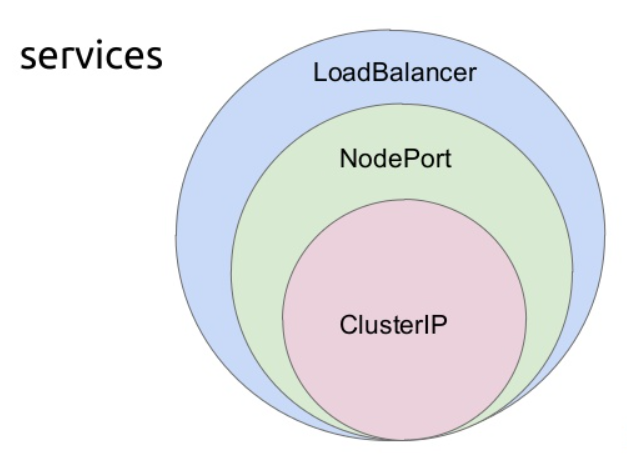
</p>

<div align="right">
    <b><a href="#">↥ back to top</a></b>
</div>

## Q. ***What is the difference between kubernetes load balancer and ingress controller?***

Load balancer distributes the requests among multiple backend services (of same type) whereas ingress is more like an API gateway (reverse proxy) which routes the request to a specific backend service based on, for instance, the URL.

* A Kubernetes LoadBalancer is a type of Service.
* A Kubernetes Ingress is not a type of Service. It is a collection of rules. An Ingress Controller in your cluster watches for Ingress resources, and attempts to update the server side configuration according to the rules specified in the Ingress.

<div align="right">
    <b><a href="#">↥ back to top</a></b>
</div>

## Q. ***How to delete all pods in kubernetes namespaces?***

Delete all the pods in a single namespace:

```bash
kubectl delete --all pods --namespace=foo
```

<div align="right">
    <b><a href="#">↥ back to top</a></b>
</div>

## Q. ***How do I force Kubernetes to re-pull an image?***

Kubernetes will pull upon Pod creation if either:

* Using images tagged :latest
* imagePullPolicy: Always is specified

**Example:**

```yaml
spec:
  containers:
  - name: myapp
    image: myregistry.com/myapp:5c3dda6b
    ports:
    - containerPort: 80
    imagePullPolicy: Always
  imagePullSecrets:
    - name: myregistry.com-registry-key
```

<div align="right">
    <b><a href="#">↥ back to top</a></b>
</div>

## Q. ***How can I keep a container running on Kubernetes?***

**Using POD Config:**

```yaml
apiVersion: v1
kind: Pod
metadata:
  name: ubuntu
spec:
  containers:
  - name: ubuntu
    image: ubuntu:latest
    # Just spin & wait forever
    command: [ "/bin/bash", "-c", "--" ]
    args: [ "while true; do sleep 30; done;" ]
```

**Using CMD in Dockerfile:**

```bash
CMD exec /bin/bash -c "trap : TERM INT; sleep infinity & wait"
```

<div align="right">
    <b><a href="#">↥ back to top</a></b>
</div>

## Q. ***What is required to deploy a simple application, like a web server in Kubernetes?***

You can run an application by creating a Kubernetes Deployment object, and you can describe a Deployment in a YAML file. For example, this YAML file **nginx-deployment.yaml** describes a Deployment that runs the nginx:31871:

```yaml
apiVersion: apps/v1
kind: Deployment
metadata:
  name: nginx
  labels:
    app: nginx
spec:
  replicas: 1
  selector:
    matchLabels:
      app: nginx
  template:
    metadata:
      labels:
        app: nginx
    spec:
      containers:
      - name: nginx
        image: nginx
        ports:
        - containerPort: 80
```

Create the deployment with following command

```bash
kubectl create -f nginx-deployment.yaml
```

The above command will create one pod with single NGINX container. The NGINX web server will start listening on port 80. Since the replicas is specified as 1 it will create only single pod for service to expose.

Check the deployment and pod is created successfully.

```bash
root@ubuntu-s-1vcpu-2gb-nyc3-01:~/single-node-kubernetes-cluster# kubectl get deployment
NAME      DESIRED   CURRENT   UP-TO-DATE   AVAILABLE   AGE
nginx     1         1         1            1           11m
root@ubuntu-s-1vcpu-2gb-nyc3-01:~/single-node-kubernetes-cluster# kubectl get pods
NAME                     READY     STATUS    RESTARTS   AGE
nginx-666865b5dd-w8q9m   1/1       Running   0          11m
```

Here is service YAML `nginx-service.yaml` file.

```yaml
apiVersion: v1
kind: Service
metadata:
  name: ngnix-service
spec:
  selector:
    app: nginx
  type: NodePort
  ports:
  - protocol: TCP
    port: 80
    targetPort: 80
```

Now, let\'s create the service.

```bash
kubectl create -f nginx-service.yaml
```

The service will be created as type NodePort. That means, it will expose the NGINX web server on each node with port 80. The appropriate pods are selected for this service depending on label selector “app: nginx”.

Check the service is created successfully.

```bash
root@ubuntu-s-1vcpu-2gb-nyc3-01:~/single-node-kubernetes-cluster# kubectl get svc
NAME            TYPE        CLUSTER-IP     EXTERNAL-IP   PORT(S)        AGE
ngnix-service   NodePort    10.96.163.55   <none>        80:31871/TCP   25m
```

Note, the port field, the NGINX service is available at node port 31871. Now you can access the web page at `http://<node IP address>:31871`

<div align="right">
    <b><a href="#">↥ back to top</a></b>
</div>

## Q. ***When would you use a Deployment versus a StatefulSet versus a DaemonSet?***

**Deployments:**

Deployment is the easiest and most used resource for deploying your application. It is a Kubernetes controller that matches the current state of your cluster to the desired state mentioned in the Deployment manifest.

**StatefulSets:**

StatefulSet(stable-GA in k8s v1.9) is a Kubernetes resource used to manage stateful applications. It manages the deployment and scaling of a set of Pods, and provides guarantee about the ordering and uniqueness of these Pods.

StatefulSet is also a Controller but unlike Deployments, it doesn\'t create ReplicaSet rather itself creates the Pod with a unique naming convention.

**DaemonSet:**

A DaemonSet is a controller that ensures that the pod runs on all the nodes of the cluster. If a node is added/removed from a cluster, DaemonSet automatically adds/deletes the pod.

Some typical use cases of a DaemonSet is to run cluster level applications like:

* Monitoring Exporters
* Logs Collection Daemon

<div align="right">
    <b><a href="#">↥ back to top</a></b>
</div>

## Q. ***What are container orchestrators and why are they required?***

Container orchestration is all about managing the lifecycles of containers, especially in large, dynamic environments. Software teams use container orchestration to control and automate many tasks:

* Provisioning and deployment of containers
* Redundancy and availability of containers
* Scaling up or removing containers to spread application load evenly across host infrastructure
* Movement of containers from one host to another if there is a shortage of resources in a host, or if a host dies
* Allocation of resources between containers
* External exposure of services running in a container with the outside world
* Load balancing of service discovery between containers
* Health monitoring of containers and hosts
* Configuration of an application in relation to the containers running it

<div align="right">
    <b><a href="#">↥ back to top</a></b>
</div>

## Q. ***What type of workloads run well on Kubernetes, and what types do not?***

A workload is an application running on Kubernetes. Whether your workload is a single component or several that work together, on Kubernetes you run it inside a set of pods. In Kubernetes, a `Pod` represents a set of running containers on your cluster.

Kubernetes provides several built-in workload resources:

* **Deployment** and **ReplicaSet** (replacing the legacy resource ReplicationController). Deployment is a good fit for managing a stateless application workload on your cluster, where any Pod in the Deployment is interchangeable and can be replaced if needed.
* **StatefulSet** lets you run one or more related Pods that do track state somehow. For example, if your workload records data persistently, you can run a StatefulSet that matches each Pod with a `PersistentVolume`. Your code, running in the Pods for that StatefulSet, can replicate data to other Pods in the same StatefulSet to improve overall resilience.
* **DaemonSet** defines Pods that provide node-local facilities. These might be fundamental to the operation of your cluster, such as a networking helper tool, or be part of an add-on.
Every time you add a node to your cluster that matches the specification in a DaemonSet, the control plane schedules a Pod for that DaemonSet onto the new node.
* **Job** and **CronJob** define tasks that run to completion and then stop. Jobs represent one-off tasks, whereas CronJobs recur according to a schedule.

<div align="right">
    <b><a href="#">↥ back to top</a></b>
</div>

## Q. ***What is the Operator pattern and when should you use it?***

Operators are software extensions to Kubernetes that make use of custom resources to manage applications and their components. Operators follow Kubernetes principles, notably the control loop.

Kubernetes operator pattern concept lets you extend the cluster\'s behaviour without modifying the code of Kubernetes itself by linking controllers to one or more custom resources. Operators are clients of the Kubernetes API that act as controllers for a Custom Resource.

Some of the things that you can use an operator to automate include:

* deploying an application on demand
* taking and restoring backups of that application's state
* handling upgrades of the application code alongside related changes such as database schemas or extra configuration settings
* publishing a Service to applications that don't support Kubernetes APIs to discover them
* simulating failure in all or part of your cluster to test its resilience
* choosing a leader for a distributed application without an internal member election process

<div align="right">
    <b><a href="#">↥ back to top</a></b>
</div>

## Q. ***How can RBAC be used to grant permission to Kubernetes resources?***

Role-based access control (RBAC) is a method of regulating access to computer or network resources based on the roles of individual users within your organization.

RBAC authorization uses the `rbac.authorization.k8s.io` API group to drive authorization decisions, allowing you to dynamically configure policies through the Kubernetes API.

To enable RBAC, start the API server with the `--authorization-mode` flag set to a comma-separated list that includes `RBAC`; for example:

```bash
kube-apiserver --authorization-mode=Example,RBAC --other-options --more-options
```

The RBAC API declares four kinds of Kubernetes object: Role, ClusterRole, RoleBinding and ClusterRoleBinding.

<div align="right">
    <b><a href="#">↥ back to top</a></b>
</div>

## Q. ***How would you expose an application running in a Kubernetes cluster to the outside world?***

A Kubernetes Service is a Kubernetes object which enables cross-communication between different components within and outside a Kubernetes cluster. It exposes Kubernetes applications to the outside world while simultaneously allowing network access to a set of Pods within and outside of a Kubernetes cluster.

**Creating a Service:**

service/load-balancer-example.yaml

```yaml
apiVersion: apps/v1
kind: Deployment
metadata:
  labels:
    app.kubernetes.io/name: load-balancer-example
  name: hello-world
spec:
  replicas: 5
  selector:
    matchLabels:
      app.kubernetes.io/name: load-balancer-example
  template:
    metadata:
      labels:
        app.kubernetes.io/name: load-balancer-example
    spec:
      containers:
      - image: gcr.io/google-samples/node-hello:1.0
        name: hello-world
        ports:
        - containerPort: 8080
```

```bash
kubectl apply -f https://k8s.io/examples/service/load-balancer-example.yaml
```

The preceding command creates a Deployment and an associated ReplicaSet. The ReplicaSet has five Pods each of which runs the Hello World application.

```bash
# Display information about the Deployment
kubectl get deployments hello-world
kubectl describe deployments hello-world

# Display information about your ReplicaSet objects
kubectl get replicasets
kubectl describe replicasets

# Create a Service object that exposes the deployment
kubectl expose deployment hello-world --type=LoadBalancer --name=my-service

# Display information about the Service
kubectl get services my-service

# ouput
NAME         TYPE           CLUSTER-IP     EXTERNAL-IP      PORT(S)    AGE
my-service   LoadBalancer   10.3.245.137   104.198.205.71   8080/TCP   54s
```

**Display detailed information about the Service:**

```bash
kubectl describe services my-service
```

Output

```bash
Name:           my-service
Namespace:      default
Labels:         app.kubernetes.io/name=load-balancer-example
Annotations:    <none>
Selector:       app.kubernetes.io/name=load-balancer-example
Type:           LoadBalancer
IP:             10.3.245.137
LoadBalancer Ingress:   104.198.205.71
Port:           <unset> 8080/TCP
NodePort:       <unset> 32377/TCP
Endpoints:      10.0.0.6:8080,10.0.1.6:8080,10.0.1.7:8080 + 2 more...
Session Affinity:   None
Events:         <none>
```

Make a note of the external IP address (`LoadBalancer Ingress`) exposed by your service. In this example, the external IP address is 104.198.205.71. Also note the value of Port and NodePort. In this example, the Port is 8080 and the NodePort is 32377.

In the preceding output, you can see that the service has several endpoints: 10.0.0.6:8080,10.0.1.6:8080,10.0.1.7:8080 + 2 more. These are internal addresses of the pods that are running the Hello World application. To verify these are pod addresses, enter this command:

```bash
kubectl get pods --output=wide

# Output
NAME                         ...  IP         NODE
hello-world-2895499144-1jaz9 ...  10.0.1.6   gke-cluster-1-default-pool-e0b8d269-1afc
hello-world-2895499144-2e5uh ...  10.0.1.8   gke-cluster-1-default-pool-e0b8d269-1afc
hello-world-2895499144-9m4h1 ...  10.0.0.6   gke-cluster-1-default-pool-e0b8d269-5v7a
hello-world-2895499144-o4z13 ...  10.0.1.7   gke-cluster-1-default-pool-e0b8d269-1afc
hello-world-2895499144-segjf ...  10.0.2.5   gke-cluster-1-default-pool-e0b8d269-cpuc
```

Use the external IP address (LoadBalancer Ingress) to access the Hello World application:

```bash
curl http://<external-ip>:<port>
```

where `<external-ip>` is the external IP address (`LoadBalancer Ingress`) of your Service, and `<port>` is the value of Port in your Service description. If you are using minikube, typing minikube service my-service will automatically open the Hello World application in a browser.

<div align="right">
    <b><a href="#">↥ back to top</a></b>
</div>

## Q. ***What is Helm Charts?***

Helm Charts are simply Kubernetes YAML manifests combined into a single package that can be advertised to your Kubernetes clusters. Once packaged, installing a Helm Chart into your cluster is as easy as running a single helm install, which really simplifies the deployment of containerized applications.

Helm has two parts to it:

* The client (CLI), which lives on your local workstation.
* The server (Tiller), which lives on the Kubernetes cluster to execute what\'s needed.

<div align="right">
    <b><a href="#">↥ back to top</a></b>
</div>

## Q. ***How to persist data in kubernetes using volumes?***

Kubernetes Persistent Volumes are a type of Volume that lives within the Kubernetes cluster, and can outlive other Kubernetes pods to retain data for long periods of time.

Persistent volumes are independent of the lifecycle of the pod that uses it, meaning that even if the pod shuts down, the data in the volume is not erased. They are defined by an API object, which captures the implementation details of storage such as NFS file shares, or specific cloud storage systems.

Kubernetes provides an API to separate storage from computation, i.e., a pod can perform computations while the files in use are stored on a separate resource. The API introduces 2 types of resources:

* **PersistentVolumes** are used to define a storage volume in the system, but their lifecycle is independant of the ones of the pods that use them. PersistentVolumes are Volume plugins and the API supports a large variety of implementation, including NFS, Glusterfs, CephFS, as well as cloud-providers such as GCEPersistentDisk, AWSElasticBlockStore, AzureFile and AzureDisk, amongst others.

* **PersistentVolumeClaims** are requests emitted by pods to obtain a volume. Once obtained, the volume is mounted on a specific path in the pod, while providing an abstraction to the underlying storage system. A claim may specify a storageClassName attribute to obtain a PersistentVolume that satisfies the specific needs of the pod.

**Example:** PersistentVolume and the associated PersistentVolumeClaim in a single file:

```yaml
---
kind: PersistentVolume
apiVersion: v1
metadata:
  name: postgres-pv
  labels:
    type: local
spec:
  storageClassName: manual
  capacity:
    storage: 100M
  accessModes:
    - ReadWriteOnce
  hostPath:
    path: "/mnt/data"
---
apiVersion: v1
kind: PersistentVolumeClaim
metadata:
  labels:
    app: postgres
  name: postgres-pv-claim
spec:
  storageClassName: manual
  accessModes:
  - ReadWriteOnce
  resources:
    requests:
      storage: 100M
```

<div align="right">
    <b><a href="#">↥ back to top</a></b>
</div>

## Q. ***How to create storage class in kubernetes?***

A StorageClass provides a way for administrators to describe the "classes" of storage they offer. Each StorageClass contains the fields `provisioner`, `parameters`, and `reclaimPolicy`, which are used when a PersistentVolume belonging to the class needs to be dynamically provisioned.

Administrators set the name and other parameters of a class when first creating StorageClass objects, and the objects cannot be updated once they are created. Administrators can specify a default StorageClass only for PVCs that don\'t request any particular class to bind to.

```yaml
apiVersion: storage.k8s.io/v1
kind: StorageClass
metadata:
  name: standard
provisioner: kubernetes.io/aws-ebs
parameters:
  type: gp2
reclaimPolicy: Retain
allowVolumeExpansion: true
mountOptions:
  - debug
volumeBindingMode: Immediate
```

<div align="right">
    <b><a href="#">↥ back to top</a></b>
</div>

## Q. ***How to deploy a kubernetes cluster on google cloud?***

These are the steps to deploy a service to GKE:

* [Create a Google Cloud Account](https://console.cloud.google.com/)
* Create a Project
* Create a Kubernetes Cluster
* Install Google Cloud SDK
* Initialize Google Cloud SDK
* Set kube config
* Push Image to the Container Registry
* Deploy Kubernetes Resources
* Create an Ingress Load Balancer
* Run Kubernetes Web UI Dashboard

**Reference:**

* *[https://cloud.google.com/kubernetes-engine/docs/tutorials/hello-app](https://cloud.google.com/kubernetes-engine/docs/tutorials/hello-app)*

<div align="right">
    <b><a href="#">↥ back to top</a></b>
</div>

#### Q. ***Kubernetes APIs have been described as both imperative and declarative. What does this mean?***

*ToDo*

<div align="right">
    <b><a href="#">↥ back to top</a></b>
</div>
